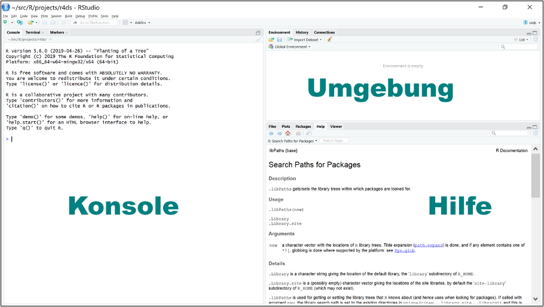
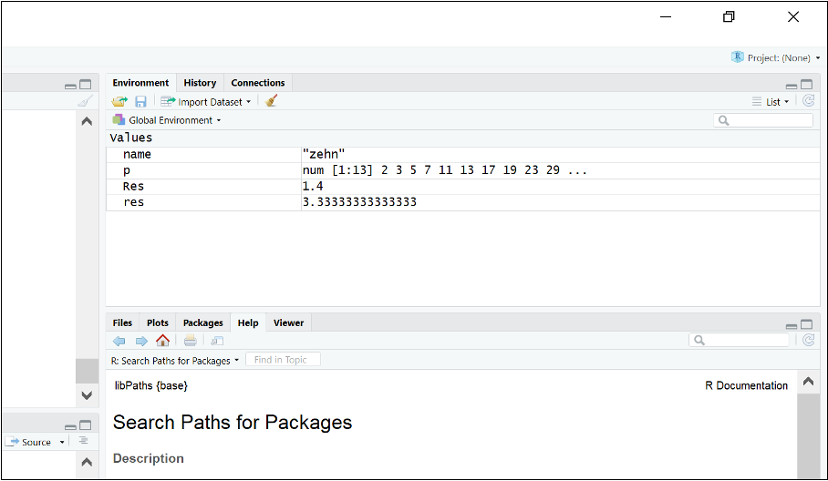
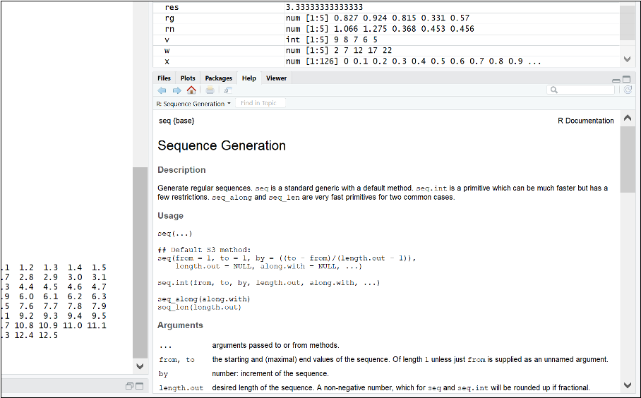
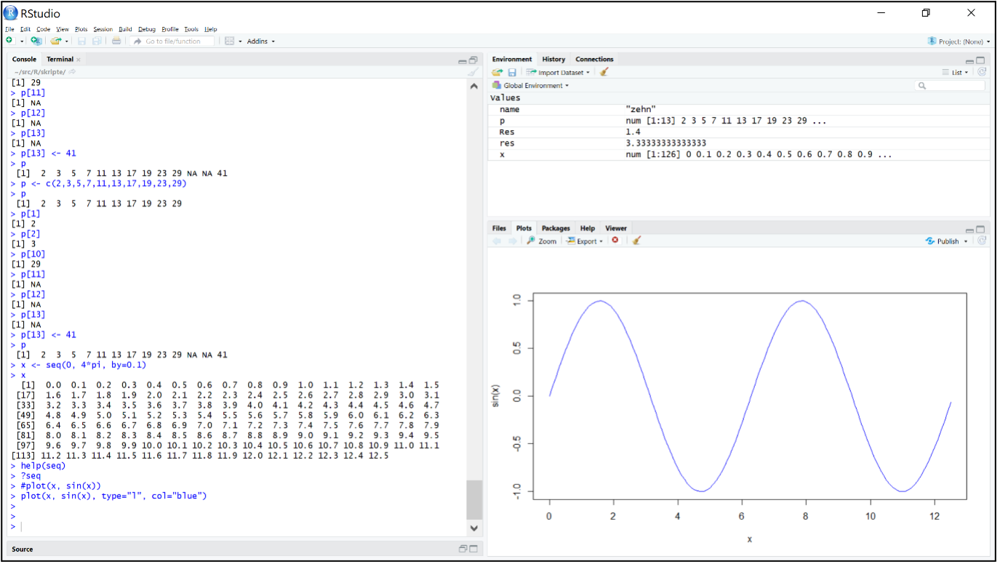
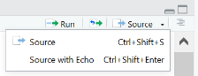
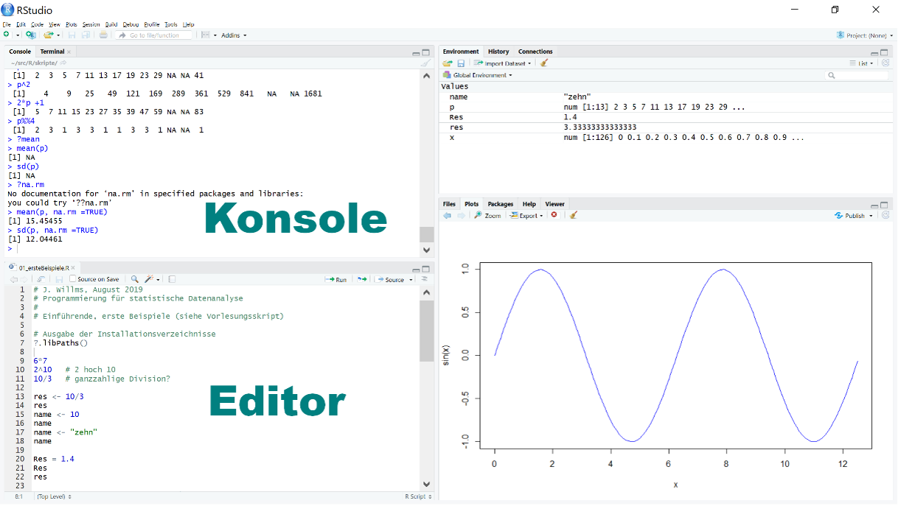
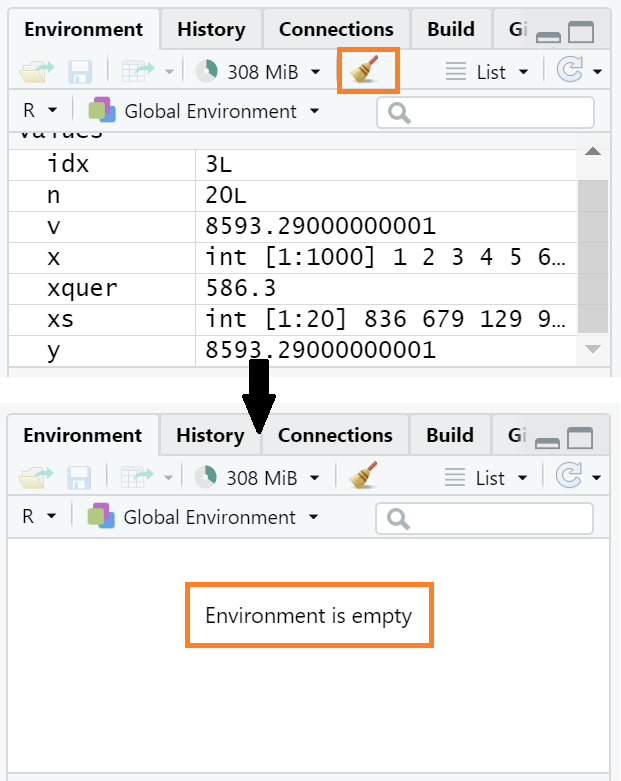
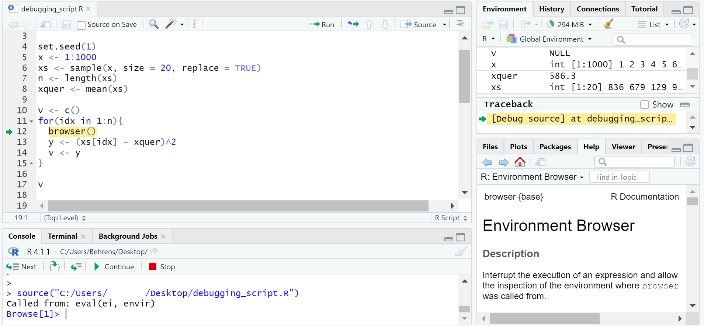
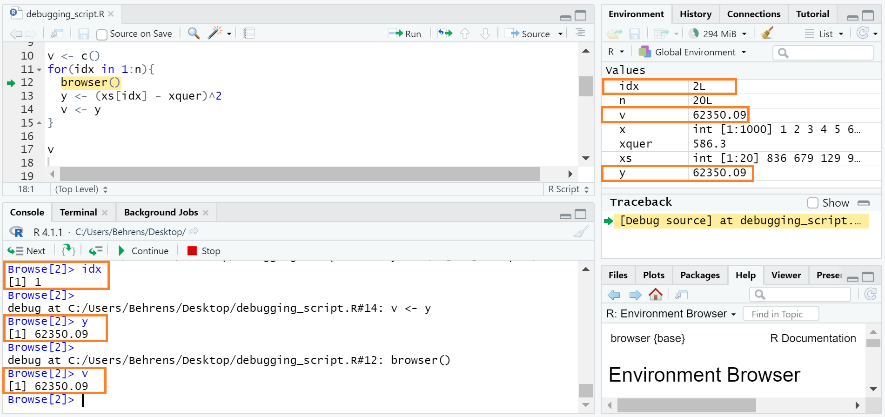
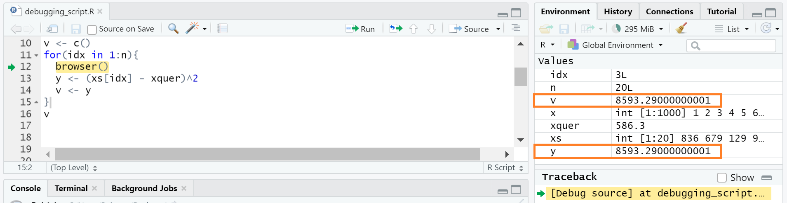

# Erste Schritte
 
Es gibt mehrere Möglichkeiten, R zu starten. Eine interaktive R-Sitzung kann zum Beispiel direkt in einem Terminalfenster (unter Windows oft auch Eingabefenster genannt) durch die Eingabe des Kommandos „R“ gestartet werden. Statt eine interaktive R-Sitzung zu beginnen, können auch sogenannte R-Skripte in einem Terminalfenster ausgeführt werden. 

Im Verlauf dieser Veranstaltung werden wir fast ausschließlich R indirekt über RStudio (genauer RStudio Desktop) starten, was viele Vorteile bietet. RStudio (genauer RStudio Desktop) ist eine integrierte Entwicklungsumgebung (IDE), die das Arbeiten mit R stark vereinfacht, und wie R als Open Source Lizenz zur Verfügung steht.

Ein typisches Fenster in RStudio umfasst mehrere Bereiche. In Abbildung 1 sehen Sie z. B. drei Bereiche: „Konsole“, „Umgebung“ und „Hilfe“. Im dort abgebildeten Konsolen-Bereich sehen wir zum Beispiel, welche R-Version und Plattform benutzt wird.

Jeder Bereich wiederum kann durch Aktivierung unterschiedlicher Reiter verändert werden. Das gesamte Layout der Bereiche kann individuell angepasst werden (siehe Menüeintrag „View“ / „Panes“). Es passt sich auch dynamisch an: So wird zum Beispiel bei einer Datenvisualisierung statt des „Hilfe“-Bereichs der „Plot“-Bereich aktiviert. Wird ein Skript geladen, erscheint zusätzlich ein Bereich „Editor“. Wir werden später sehen, was R-Skripte (kurz: Skripte) sind und welche Bedeutung sie haben. Wir starten jedoch zuerst mit ganz einfachen Befehlen in der Konsole. 

```{r, echo=FALSE, fig.cap="RStudio Bereiche.", out.width="100%"}

```

Im Bereich „Hilfe“ in Abbildung 1 sehen Sie den Manual-Eintrag zum Befehl `.libPaths()`. Sie erhalten diesen Eintrag, indem Sie  `?.libPaths()` im Konsolenbereich hinter dem Prompt-Zeichen `>` eingeben. Wir werden später auf das Hilfesystem etwas ausführlicher eingehen.


## Numerische Ausdrücke

Befehle (engl.: commands) können direkt im Bereich „Konsole“ hinter dem Prompt-Zeichen `>` eingegeben werden.

```{r}
6*7
```

Sie erhalten sofort das Ergebnis des eingegebenen Ausdrucks. Ist der eingegebene Ausdruck syntaktisch noch nicht abgeschlossen, dann wechselt in der Konsole das Prompt-Zeichen '>' zu '+'; mit einem Semikolon kann ein Abschluss erzwungen werden. 

```{r}
2^10   # Potenzrechnung: 2 hoch 10
```

Wie wir in diesem Beispiel zusätzlich sehen können, werden wie in vielen anderen Programmiersprachen auch alle Zeichen in einer Zeile, die nach einem '#' folgen, als Kommentar interpretiert.

```{r}
10/3   # Division
```

Auch sehen wir in diesem Beispiel, dass R wie C, C++ oder Java nicht ein Komma, sondern einen Punkt als Dezimaltrennzeichen verwendet.

**Kurzzusammenfassung**

> - Alle Zeichen in einer Zeile, die nach einem `#` folgen, werden als Kommentar interpretiert
> - Punkt ist Dezimaltrennzeichen

## Variablen

Wir können das Ergebnis einer Berechnung natürlich auch einer Variablen zuweisen. Wie wir später sehen werden, handelt es sich dabei um eine **globale** Variable!

```{r}
res = 10/3       # '=' sollte vermieden werden
```

Allerdings bleibt dann das Ergebnis der Berechnung verborgen. Dies sehen wir erst, wenn wir `print(res)` oder kürzer `res` eingeben

```{r}
res
```

Es ist allerdings in R üblich, anstelle von '=' den Operator '<-', der aus zwei Buchstaben besteht, für eine Zuweisung zu benutzen. Das hat zum Teil historische Gründe; aber es gibt auch spezielle Situationen, wo '=' als Zuweisungsoperator nicht wie erwartet funktioniert. Also besser:

```{r}
res <- 10/3      # Besser
res
```

Weil Zuweisungen oft benutzt werden, gibt es für '<-' in RStudio eine besondere Tastenkombination: Alt-'-'. Im Gegensatz zu C oder C++ müssen in R Variablen nicht vorher vereinbart werden und sind nicht fest für den Rest ihrer Geltungsdauer an einem bestimmten Datentyp gebunden, wie das nächste Beispiel zeigt:

```{r}
name <- 10
name
name <- "zehn"
name
```

Zuerst verweist in dem obigen Beispiel die Variable `name` auf den numerischen Wert 10. Nach einer erneuten Zuweisung weist dann die Variable `name` auf die Zeichenkette "zehn", also auf ein Objekt eines ganz anderen Datentyps. Dies ist in C oder C++ so nicht möglich! Wie wir sehen werden, ist R vektorbasiert und unsere vorläufige Analyse, dass in dem obigen Beispiel `name` auf den numerischen Wert 10 bzw. auf eine Zeichenkette verweist, ist ungenau. Besser wäre die Formulierung, dass im ersten Fall die Variable `name` auf einen numerischen Vektor zeigt, der aus nur einem Element besteht. Für den zweiten Fall gilt Ähnliches. 

R unterscheidet grundsätzlich zwischen Groß- und Kleinschreibung. So bezeichnen zum Beispiel `res` und `Res` zwei unterschiedliche Variablen:

```{r}
Res <- 1.4   # Groß- und Kleinschreibung beachten!
Res
res
```

Es gibt Einschränkungen für Variablennamen, auf die wir aber nicht detailliert eingehen werden. Abgesehen von Schlüsselworten wie `TRUE` oder `if` (siehe auch `?Reserved` für eine Liste aller Schlüsselworte) sind grundsätzlich alphanumerische Zeichen aus dem ursprünglichen ASCII-Zeichensatz erlaubt, aber keine Umlaute oder Sonderzeichen mit Ausnahme von '_' und '.' . Das erste Zeichen sollte ein Buchstabe sein. Der Begriff `syntatic names` bezieht sich auf erlaubte Namen (im Gegensatz zu `non-syntatic names`).

Mittlerweile gibt es eine ganze Reihe von unterschiedlichen Style-Guides, wie:

-	https://jef.works/R-style-guide/
-	https://google.github.io/styleguide/Rguide.xml
-	http://adv-r.had.co.nz/Style.html

Wir wollen im Folgenden der Empfehlung folgen, Variablen- und Funktionsnamen klein zu schreiben und Großbuchstaben lediglich für die Trennung separater Worte zu nutzen (der sogenannte „*camelCase*“, im Gegensatz zu dem von manchen Autoren bevorzugten „*snake_case*“). Insbesondere wollen wir auch nicht das Sonderzeichen '.' in Variablen- und Funktionsnamen nutzen, da es in manchen Bereichen wie Klassen eine unterschiedliche Bedeutung hat.

**Kurzzusammenfassung**

> - Für eine Zuweisung `<-` benutzen
> - Die Tastenkombination `Alt + -` steht in RStudio für  `<-` 
> - In R werden Anweisungen nicht durch ein Semikolon abgeschlossen
> -	Variablen müssen nicht vorher vereinbart werden 
> -	Variablen sind nicht fest an einen bestimmten Datentyp gebunden
> - R unterscheidet zwischen Groß- und Kleinschreibung

## Vektoren

Vektoren spielen in R eine zentrale Rolle und wir werden in einem späteren Kapitel detailliert auf Vektoren eingehen. An dieser Stelle wollen wir zur Einführung lediglich ein erstes Beispiel mit numerischen Vektoren vorstellen. Ein Vektor ist wie ein Feld (array) eine Datenstruktur, die eine Folge von Elementen desselben Typs enthält. Erzeugt werden soll im nächsten Beispiel ein einfacher Datensatz `p`, der die ersten zehn Primzahlen enthält:

```{r}
p <- c(2,3,5,7,11,13,17,19,23,29) # Erzeugt einen Vektor der Länge 10
p
```

`p` verweist nun auf einen Vektor, der die ersten zehn Primzahlen enthält. Die Größen `2, 3, 5, 7, 11, 13, 17, 19, 23, 29` werden mithilfe der Funktion `c()` zu einem numerischen Vektor zusammengefasst und der Variablen `p` zugewiesen; `c` steht hier für *concatenate* (deutsch: aneinanderhängen) und gibt immer einen Vektor zurück. Wie in C haben wir mithilfe des Indexoperators `[]` wahlfreien Zugriff auf die einzelnen Elemente des Vektors. Aber im Gegensatz zu C und vielen anderen Programmiersprachen beginnt die Indexierung in R nicht bei 0 sondern bei 1!

```{r}
p[1]
p[2]
p[10]
```

Was passiert, wenn wir über die Indexgrenzen hinweggehen? In C und C++ ist dies ein Fehler!

```{r}
p[11]
p[12]
p[13]
```

In R hingegen ist dies nicht fehlerhaft! R benutzt das Symbol `NA` (*not available*), um anzuzeigen, dass ein Wert nicht vorhanden ist (im Englischen oft als „missing data“ bezeichnet). Unser Beispieldatensatz besteht nach wie vor aus 10 Elementen. Was passiert aber, wenn wir dem 13. Element einen Wert zuweisen?

```{r}
p[13] <- 41
p
```

Offenbar hat sich jetzt die Größe des Vektors `p` dynamisch angepasst: `p` besteht nun aus dreizehn Elementen. Sowohl das elfte als auch das zwölfte Element hat jedoch keinen regulären numerischen Wert. Auf Vektoren werden wir später noch sehr ausführlich eingehen.


In R kann man ähnlich wie z.B. in MATLAB Operatoren direkt auf Vektoren anwenden:

```{r}
p
p^2
2*p + 1
p %% 4 # Modulo-Operator
```

Hier bezeichnet „%%“ den Modulo-Operator; er gibt den Rest bei einer ganzzahligen Division zurück. Ebenso können Funktionen auf Vektoren angewandt werden. So gibt es zum Beispiel die Funktionen `mean()` und `sd()`, die das arithmetische Mittel und die Standardabweichung zurückgeben.

```{r}
mean(p)
sd(p)
```

Hier bereiten die fehlenden Werte Probleme und die beiden Funktionen können die statistischen Größen nicht berechnen. Allerdings kann man bei vielen Funktionen durch den Parameter `na.rm =TRUE`  angeben, dass fehlende Werte nicht berücksichtigt werden sollen:

```{r}
mean(p, na.rm=T)
sd(p, na.rm=T)
```

Es ist nicht überraschend, dass man Funktionen wie `mean()` oder `sd()` auf Vektoren anwenden kann. Aber wie sieht dies mit Funktionen wie `sqrt()` aus? Die Funktion `sqrt()` gibt die Wurzel einer Zahl zurück und wird in vielen Programmiersprachen üblicherweise auf skalare Werte angewandt.

```{r}
sqrt(p)
```

Auch hier haben wir ein ähnliches Verhalten wie in MATLAB; die Funktion `sqrt()` wird auf jedes Element des Vektors angewandt. Als Ergebnis wird ein Vektor gleicher Länge zurückgegeben („*vector in, vector out*“). Solche Funktionen nennt man auch *vektorisierbar*.In einem folgenden Abschnitt werden wir sehen, dass zum Beispiel Funktionen, die eine `if-else` Verzweigung enthalten, nicht (direkt) vektorisierbar sind.

**Kurzzusammenfassung**

> - Mit `c()` können Vektoren erzeugt werden
> - Indexierung beginnt in R nicht bei `0` sondern bei `1`!
> - `NA` (not available) wird benutzt, um anzuzeigen, dass ein Wert nicht vorhanden ist. 
> - `%%` Modulo-Operator
> - Operatoren und Funktion können direkt auf Vektoren angewandt werden
> - Durch `na.rm = TRUE` werden bei vielen Funktionen `NA`-Werte ignoriert
> - Funktionen: `mean()`, `sd()`, `sqrt()`
> - vektorisierbare Funktionen

## Recycling

Manchmal verlangt eine Operation, dass alle beteiligten Vektoren dieselbe Länge haben. In diesem Fall ergänzt R die kürzeren Vektoren, indem es seine Werte periodisch wiederholt. Dieses Verhalten nennt man auch *Recycling*.

```{r}
x <- rep(1, 6) # entspricht c(1,1,1,1,1,1)
x
y <- c(1,2)
x+y
```

Der Funktionsaufruf `rep(x,n)` (für *replicate*) erzeugt ein Objekt des gleichen Typs wie `x`, das den Wert von `x` genau `n`-mal wiederholt. Berechnet wurde in diesem Fall also 

```{r}
c(1,1,1,1,1,1) + c(1,2,1,2,1,2)
```

Allerdings gibt es eine Warnung, wenn die Länge des größeren Vektors kein Vielfaches des kleineren Vektors ist:

```{r, warning=T}
x <- rep(1,6)
y <- 1:4   # wie c(1L, 2L, 3L, 4L)
str(y)
x+y
```

Allgemein wird durch einen Ausdruck wie `n:m` (wobei `n` und `m` ganze Zahlen sind) ein Vektor erzeugt, dessen erstes Element `n` ist, dessen letztes Element `m` ist und aufeinanderfolgende Elemente sich entweder alle um 1 oder alle um -1 unterscheiden.

Wie man in der Manual-Hilfe sieht, ist `rep_len(x, length.out)` eine Variante von `rep()`. `rep_len(x, length.out)` gibt eine periodisch fortgesetzte Kopie von `x` mit der Länge `length.out` zurück:

```{r}
rep_len(1:3, 5)
rep_len(1:3, 7)
```

**Frage**

- Welchen Wert hat der Vektor `7.1:3.3`?
- Welchen Wert hat der Vektor `2:5 + 10`?

Wenn man weiß, ob der Additions- oder der Bereichsoperator eine höhere Priorität hat, dann kann man die letzte Frage leicht beantworten. `?Syntax` liefert dabei folgende Antwort; die Operatoren sind gemäß ihrer Priorität (mit höchster Priorität zuerst) aufgelistet:

Operator      | Beschreibung
--------------|---------------------------------
`::` `:::`	| access variables in a namespace
`$` `@`	    | component / slot extraction
`[` `[[`	  | indexing
`^`	      | exponentiation (right to left)
`-` `+`	    | unary minus and plus
`:`	      | sequence operator
`%any%`	  | special operators (including %% and %/%)
`*` `/`	    | multiply, divide
`+` `-`	    | (binary) add, subtract
`<` `>` `<=` `>=` `==` `!=`	| ordering and comparison
`!`	      | negation
`&` `&&`	  | and
`|` `||`	| or
`~`      | as in formulae
`->` `->>`	| rightwards assignment
`<-` `<<-`	| assignment (right to left)
`=`	      | assignment (right to left)
`?`	      | help (unary and binary)

**Kurzzusammenfassung**

> - Recycling
> - Funktionen: `rep()`
> - `y <- 1:4`  (oder allgemeiner `n:m`)
> - Priorität der Operatoren

## RStudio

Im Bereich „Umgebung“ sehen wir nun die von uns erzeugten globalen Variablen und deren aktuelle Werte. Hier werden die Namen aller erzeugten Objekte aufgelistet; dies bezieht sich sowohl auf Daten als auch auf Funktionen (und andere Objekte). Zusätzlich erhält man neben den Namen eine kurze und kompakte Zusammenfassung der entsprechenden Werte.

Mithilfe der Cursortasten ↑ und ↓ kann im Konsolenbereich von RStudio innerhalb der bereits eingegebenen Befehle navigiert werden. Mit den → und ← kann der Cursor innerhalb der aktuellen Befehlszeile bewegt werden und gegebenenfalls Korrekturen vorgenommen werden. Alternativ kann der Reiter „History“ (in dem Bereich rechts oben) aktiviert werden, so dass alle eingegebenen Befehle sichtbar werden. 

```{r, echo=FALSE, fig.cap="Die erzeugten globalen Variablen RStudio im Bereich 'Umgebung'.", out.width="100%"}

```

RStudio bietet viele hilfreiche Unterstützungen an, von denen wir allerdings nur einige vorstellen werden. Weiterführende Dokumentationen finden Sie u. a. unter dem Menüeintrag „Help“ / „RStudio Docs“.
RStudio bietet ein umfangreiches Hilfesystem an. Wir wollen dies an einem Beispiel demonstrieren.

```{r}
x <- seq(0, 4*pi, by = 0.1)
x
```

Aus  diesem Beispiel kann man bereits erahnen, was die Funktion `seq()` bewirkt. Durch `help(seq)` oder kürzer durch `?seq` erhält man in RStudio den entsprechenden Manual-Eintrag. Weiterhin bezeichnet hier `pi` eine in R eingebaute Konstante, die der Kreiszahl entspricht (Verhältnis des Umfangs eines Kreises zu seinem Durchmesser).

```{r, echo=FALSE, fig.cap="Manual-Eintrag angezeigt in RStudio.", out.width="100%"}

```

Die Eingabe von `x` im Konsolenbereich (hinter dem Prompt-Zeichen `>`) bewirkt, dass die Funktion `print(x)` aufgerufen wird. Enthält `x` viele Daten, kann dies schnell sehr unübersichtlich werden. Daher gibt es die Funktion `str()`, die eine alternative kompakte Darstellung bereitstellt (`str` steht hier für *structure*):

```{r}
str(x)
```

Hieraus entnehmen wir, dass `x` ein numerischer Vektor mit insgesamt 126 Elementen ist.
Schließlich wollen wir noch den „Plot“-Bereich in RStudio kurz vorstellen. Dazu geben wir folgenden Befehl ein.

```{r, eval=FALSE}
plot(x, sin(x), type = "l", col = "blue")
```

Durch `type = "l"` legen wir fest, dass die einzelnen Punkte durch Linien verbunden werden sollen, und durch `col = "blue"`, dass die Zeichenfarbe blau sein soll.

```{r, echo=FALSE, fig.cap="Plot in RStudio.", out.width="100%"}

```

**Kurzzusammenfassung**

> - Cursortasten im Konsolenbereich von RStudio
> - Durch `?xyz` erhält man den Manual-Eintrag von `xyz`
> - `str()` für eine kompakte textuelle Darstellung

## Demos

R bietet standardmäßig unterschiedliche Präsentationen an, siehe `?demo`. Um z.B. eine kurze Demo über die Grafikmöglichkeiten in R zu erhalten, geben sie `demo(graphic)` ein.

Daneben gibt es hauptsächlich zu Übungszwecken unterschiedliche Datensätze, siehe `?datasets` bzw. `library(help = "datasets")`. Wir werden kurz auf den Datensatz `Nile` eingehen, der die jährliche Durchflussmenge $\left(\text{in }\left[10^8 m^3\right]\right)$ am Nil in Aswan (früher Assuan) zwischen 1871 und 1970 beschreibt.

```{r}
str(Nile)
Nile
```

Hierbei werden wir jedoch nicht auf alle Einzelheiten eingehen, sondern wir wollen beispielhaft einige Möglichkeiten von R aufzeigen. Mittelwert und Standardabweichung sind schnell berechnet:

```{r}
mean(Nile)
sd(Nile)
```

Mit `summary()` erhalten wir diese beiden Werte zusammen mit vier anderen wichtigen statistischen Kennzahlen (Minimum, untere und obere Quartil und Median),  auf die wir an dieser Stelle nicht weiter eingehen wollen (siehe auch `?summary`):

```{r}
summary(Nile)
```

Ein Plot der Daten ist ebenfalls schnell erzeugt:

```{r}
plot(Nile)
```

Ebenso ist ein Histogramm:

```{r}
hist(Nile)
```

und ein Boxplot schnell erstellt:

```{r}
boxplot(Nile)
```

In R sind bereits viele Funktionen zu häufig verwendeten Wahrscheinlichkeitsverteilungen implementiert. Exemplarisch wollen wir an dieser Stelle die Funktionen `rnorm()` und `runif()` betrachten (siehe `?rnorm` und `?runif`). Beide Funktionen geben Pseudozufallszahlen gemäß der Normalverteilung bzw. der Gleichverteilung zurück. Werden keine weiteren Argumente spezifiziert, dann wird bei der Normalverteilung Mittelwert 0 und Standardabweichung 1 angenommen; entsprechend gibt  `rnorm(n)` einen Vektor mit `n` normalverteilten Pseudozufallszahlen zurück:

```{r}
rnorm(10)
```

Bei der Gleichverteilung wird standardmäßig vom Intervall [0,1] ausgegangen; entsprechend gibt `runiform(n)` einen Vektor mit `n` in  [0,1] gleichverteilten Pseudozufallszahlen zurück:

```{r}
runif(10)
```

Wenn wir im Folgenden von erzeugten Zufallszahlen (oder zufälligen Werten) sprechen, dann meinen wir stets *Pseudozufallszahlen*.

```{r}
y <- rnorm(1000)
summary(y)
x <- rnorm(10000)
summary(x)
```

Um zu prüfen, ob die erzeugten Zufallszahlen einer Normalverteilung genügen, können wir als ersten Test ein Histogramm erzeugen:

```{r}
hist(y)
```

Die Anzahl der Klassen im Histogramm ist selbst für den kleinen Datensatz `y` eigentlich zu klein. Es ist oft nicht ganz so einfach, die „richtige“ Anzahl der Klassen in einem Histogramm zu bestimmen. Für den größeren Datensatz `x` wollen wir 100 unterschiedliche Klassen im Histogramm benutzen. Mit `breaks` kann die Anzahl der Klassen im Histogramm beeinflusst werden (siehe `?hist`). 

```{r}
hist(x, breaks = 100)
```

Wenn man dieses Bild mit der „hochskalierten“ theoretischen Wahrscheinlichkeitsdichte der Normalverteilung in der nächsten Abbildung vergleicht, dann sieht man, dass die so erzeugten Zufallszahlen diesen ersten groben Test bestanden haben. Für die Erzeugung der nächsten Abbildung benutzen wir dabei in der Plot-Funktion die Funktion `dnorm()`, die die Werte der Wahrscheinlichkeitsdichte (density) der Normalverteilung zurückgibt: 

```{r}
z <- seq(-4, 4, by = 0.1)
plot(z, 100000*dnorm(z), type="l", col="blue")
```

Das Gleiche wollen wir mit zufällig erzeugten gleichverteilten Werten wiederholen:

```{r}
y <- runif(1000)
summary(y)
x <- runif(10000)
summary(x)
hist(y)
hist(x, breaks = 100)
```

Auch hier sieht man, dass die erzeugten Werte im Intervall [0,1] ziemlich gleichverteilt sind. Mit R kann man relativ leicht, komplexere statistische Tests durchführen, um die Güte der erzeugten zufälligen Werte im Vergleich zu den vorgegebenen Verteilungen zu bestimmen.  Dazu sind aber umfangreichere statistische Kenntnisse erforderlich, die den Rahmen an dieser Stelle sprengen würden.

Um „zufällige“ Zahlen zu erzeugen, benutzt R intern einen Zufallszahlengenerator (*RNG*, *random number generator*), der beim Start mithilfe der aktuellen Systemzeit immer unterschiedlich (und scheinbar zufällig) initialisiert wird. Um jedoch reproduzierbare „zufällige“ Werte zu erhalten, muss der Zufallszahlengenerator mit einer festen Zahl initialisiert werden; genau dies leistet `set.seed()`:

```{r}
set.seed(1)
rnorm(3)

set.seed(1)
rnorm(3)
```

## Skripte

Befehle direkt in die Konsole einzugeben kann manchmal sehr hilfreich sein, aber spätestens, wenn man Ergebnisse reproduzieren oder die Herleitung der Ergebnisse dokumentieren will, ist es sinnvoller, mit Skripten zu arbeiten. R-Skripte sind einfache Textdateien mit der Endung „.R“, die R-Befehle und Kommentare enthalten. Im Folgenden werden wir auch nicht mehr von Befehlen sprechen, sondern den mehr oder weniger äquivalenten Begriff „*Anweisung*“ (engl.: statement) benutzen, der im Skript-und Programmierumfeld gebräuchlicher ist.

Abgesehen von kleinen Berechnungen zu Testzwecken und dem Aufrufen von Manual-Seiten sollten Sie im Folgenden fast immer Skripte benutzen! Im Downloadbereich finden Sie Skripte, die alle R-Beispiele dieses Skriptes enthalten sollten.

Als integrierte Entwicklungsumgebung verfügt RStudio über einen Texteditor, mit dem Sie einfach Codebereiche an die Konsole schicken können. Wird ein Skript geladen, erscheint in RStudio ein zusätzlicher Bereich „Editor“, der den Texteditor enthält. RStudio wird beim Beenden automatisch alle offene Skripte speichern und beim erneuten Starten von RStudio werden die Skripte automatisch wieder geladen. Manuell können Sie über den Menüeintrag „File“ / „Open file …“ oder über „New File“ / „R Skript …“ ein Skript laden.

Als Nächstes öffnen Sie das Skript [02_jw_psd_b.R](sources/r_WS19_Willms_src/02_jw_psd_b.R), das Sie im Downloadbereich finden. Im Texteditor können Sie nun Anweisungen und Kommentare verändern und einfügen. Mit der Tastenkombination `Strg-Enter` schicken Sie stets den kompletten Befehl, der durch die aktuelle Position des Cursors bestimmt ist, an die Konsole, wo er unmittelbar ausgeführt wird. In der Konsole erscheint sofort das Ergebnis. Mit `Strg-Shift-Enter` wird hingegen das gesamte Skript in der Konsole ausgeführt. Alternativ können Sie auch die entsprechenden Menü-Icons benutzen.

```{r, echo=FALSE, fig.cap="Befehlsausführung im RStudio-Texteditor.", out.width="60%"}

```

```{r, echo=FALSE, fig.cap="Zusätzlicher Editor-Bereich in R-Studio.", out.width="100%"}

```

## Einführung in die Entwicklungsumgebung von R

Nachdem Sie mit viel Mühe und Zeit ein R-Skript erstellt haben, stellen Sie fest, dass das Ergebnis nicht dem entspricht, das Sie erwartet haben. Was tun Sie nun?

In diesem Abschnitt sind einige Tipps angeführt, wie Sie Ihre Skripte auf mögliche Fehler kontrollieren und diese ggf. identifizieren können.  

Wir wollen dies anhand folgenden Codes bzw. Problems beispielhaft illustrieren:

Die Aufgabe besteht darin, für jedes Element des Vektors `xs` die quadrierte Abweichung vom Mittelwert zu bestimmen. Folglich wird als Ergebnis ein Vektor erwartet, den wir `v` nennen.

Wird der folgende Code ausgeführt, erhalten wir allerdings keinen Vektor sondern nur einen Wert. Wo liegt der Fehler?

```{r}
set.seed(1)
x <- 1:1000
xs <- sample(x, size = 20, replace = TRUE)
n <- length(xs)
xquer <- mean(xs)

v <- c()
for(idx in 1:n){
  y <- (xs[idx] - xquer)^2 
  v <- y 
}

v
```

**Tipps zur Fehleridentifizierung:**

1. Oft haben Sie mehrere R-Skripte parallel oder seriell geöffnet. Folglich kann es sein, dass in Ihrer *Environment* (*Umgebung*) bereits einige Objekte definiert sind. Um zu kontrollieren, ob Objekte *einfach nur* überschrieben wurden und der Fehler möglicherweise gar nicht in Ihrem Skript bzw. in Ihrer Programmierung liegt, leeren Sie die *Environment* und führen Sie Ihr Skript bzw. Ihren Code erneut aus: Klicken Sie dafür auf das *Besen*-Symbol (in Abbildung \ref{fig:abb-workspace} orange umrandet) (*Clear objects from the workspace*). Bestätigen Sie die anschließende Meldung mit "Yes" und Ihre *Environment* ist leer. Führen Sie Ihr Skript erneut aus.

```{r abb-workspace, echo=FALSE, fig.cap="Workspace bzw. Environment leeren.", out.width="60%"}

```

In unserem Beispiel hat das Leeren der *Environment* und das erneute Ausführen des Skripts zu keiner Fehlerbehebung geführt. 

2. Wir vermuten, dass der Fehler innerhalb der `for`-Schleife liegt. Folglich würde es uns helfen, wenn wir die Schleife schrittweise durchlaufen und überprüfen würden, weshalb die einzelnen ermittelten quadratischen Abweichungen nicht in Form eines Vektors gespeichert werden. Dies erreichen wir, indem wir einen *Breakpoint* in unserer Schleife z.B. mittels `browser()` wie folgt setzen [@McPherson2022]:

```{r, eval=FALSE}
set.seed(1)
x <- 1:1000
xs <- sample(x, size = 20, replace = TRUE)
n <- length(xs)
xquer <- mean(xs)

v <- c()
for(idx in 1:n){
  browser() # Breakpoint setzen
  y <- (xs[idx] - xquer)^2 
  v <- y 
}

v
```

Das im Folgenden beschriebene Vorgehen sowie weitere hilfreiche Tipps und Alternativen zum Thema *Debugging* sind @McPherson2022 zu entnehmen.
Klicken wir dann auf *Source*, wird die Funktion `browser()` gelb markiert und ein grüner Pfeil erscheint am linken Rand:

```{r abb-debug1, echo=FALSE, fig.cap="(ref:debug-browser)", out.width="100%"}

```

(ref:debug-browser) Debugging mithilfe der Funktion `browser()`.

Darüber hinaus

+ öffnet sich ein Feld namens *Traceback* und 

+ in der Konsole erscheint eine Leiste mit Optionen wie *Next*, *Stop* etc., die uns den *Debugging-Modus* anzeigen.

Die einfachste Möglichkeit, um die `for`-Schleife schrittweise zu durchlaufen, besteht im Drücken der `Enter`-Taste. Dadurch *wandern* das gelbe Feld und der grüne Pfeil nach unten. Auf die Werte der Variablen - in unserem Beispiel `idx`, `y` und `v` kann zugegriffen werden, indem diese über die  *Console* abgefragt über die *Environment* mitverfolgt werden (siehe Abbildung \@ref(fig:abb-debug2). In der Abbildung \ref{fig:abb-debug2} wurde die Schleife ein Mal vollständig durchlaufen, sodass `idx` nun den Wert `2` annimmt (siehe *Environment*).

```{r abb-debug2, echo=FALSE, fig.cap="(ref:debug-browser2)", out.width="100%"}

```

(ref:debug-browser2) Vollständiges Durchlaufen der `for`-Schleife für `idx = 1` und Zugriff auf die Zwischenwerte, die die Variablen `idx`, `y` und `v` annehmen.

Weiterhin sehen wir in der Abbildung \ref{fig:abb-debug2}, dass `v` aus einem Wert besteht, was wir erwarten, da bislang nur die quadratische Abweichung vom Mittelwert des ersten Elements des Vektors `xs` bestimmt wurde. Die Werte `v` und `y` sind somit identisch.

Durchlaufen wir die Schleife ein weiteres Mal (siehe Abbildung \ref{fig:abb-debug3}) sehen wir erneut, dass `v` und `y` identisch sind, wohingegen wir erwarten würden, dass `v` nun zwei Werte enthält, da wir die quadratische Abweichung vom Mittelwert bislang für zwei Werte bestimmt haben.

```{r abb-debug3, echo=FALSE, fig.cap="(ref:debug-browser3)", out.width="100%"}

```

(ref:debug-browser3) Vollständiges Durchlaufen der `for`-Schleife für `idx = 1` und `idx = 2` und Zugriff auf die Zwischenwerte, die die Variablen `idx`, `y` und `v` annehmen.

Daraus können wir schließen, dass der Vektor `v` **nicht** nach jedem Durchlauf der `for`-Schleife *verlängert* wird, weshalb wir den Code wie folgt abändern müssen:

```{r, eval=FALSE}
set.seed(1)
x <- 1:1000
xs <- sample(x, size = 20, replace = TRUE)
n <- length(xs)
xquer <- mean(xs)

v <- c()
for(idx in 1:n){
  y <- (xs[idx] - xquer)^2 
  v <- c(v, y) 
}

v
```

Für einige mag das Problem bei diesem Code vielleicht sofort offensichtlich gewesen sein. Liegt Ihnen jedoch ein viel umfangreicherer Code vor, so ist dieses Problem nicht sofort offensichtlich und *Debugging* ist ein hilfreiches Tool.

**Kurzzusammenfassung**

> - Anweisung versus Befehl
> - `Strg-Enter`: die aktuelle Anweisung zur Ausführung an die Konsole senden
> - `Strg-Shift-Enter`: das gesamte Skript wird in der Konsole ausgeführt
> - `summary()`
> - `plot()`, `boxplot()` und `hist()`
> - `rnorm()`, `runif()`, `dnorm()`
> - `set.seed()`

## Übungen {-}

Alle Aufgaben beziehen sich auf die Programmiersprache R! In den Übungen werden an manchen Stellen R-Funktionen benutzt, die im Skript nicht detailliert erläutert werden. Benutzen Sie deswegen ausgiebig die entsprechenden Manual-Einträge und Hilfe-Systeme.

### Aufgabe 1 {-}

a) Öffnen Sie das Skript [02_jw_psd_b.R](sources/r_WS19_Willms_src/02_jw_psd_b.R) und führen Sie es schrittweise aus.

b) Erstellen Sie ein Skript „01_ersteBeispiele2.R“, indem Sie das Skript aus Aufgabenteil a) leicht abwandeln. Untersuchen Sie, wie im Editor Fehler unmittelbar angezeigt werden und testen Sie die *Autovervollständigung* in der Konsole und im Editor.

### Aufgabe 2 {-}

Erstellen Sie im RStudio ein Projekt „psd_1“  in einem neu zu erstellenden Verzeichnis „psd_1“. Alle relevanten Quelldateien für den ersten Teil des Skripts und der entsprechenden Übungen sollen in Ihrem Verzeichnis „psd_1“ gespeichert sein. 

### Aufgabe 3 {-}

a) Welchen Wert haben folgende Anweisungen?

    Anweisung   | Wert (Antwort)        
    -------------|-------------
    `1 / 0` | 
     `0 / 0` | 
    `1 / 0 - 1 / 0`| 
    Was ist der Unterschied zwischen `Inf` und `NaN`? (siehe `?NaN`) |
    `47 %% 10` | 
     `47 %/% 10` |
    (Hinweis: siehe `?'%/%'`) |
    `-9 %% 5` |
    `-11 %% 5` |
     `3.1 %% 3` |
    `pi %% 3` |
       | 
    `factorial(5)` | 
    `factorial(60)` |
    `abs(-3)` |
    `choose(4,2)` |
    `choose(6,1)` |
    `choose(6,2)` |
    `choose(6,3)` |
    `choose(6,4)` |
    `choose(49,6)`|
    Was hat der letzte Ausdruck mit Lotto zu tun? |
          | 
    `x <- 1:6` |
    `tan(atan(x))` |
    `log(exp(x))`  |


b)	Wenn `x <- c(2,3,5,2)`, was wird ausgegeben und wieso? Erstellen Sie zusätzlich eine kurze Beschreibung der Funktionen.

    Anweisung   | Wert und Antwort       
    -------------|-------------
    `sum(x)` |
    `prod(x)` |
    `cumsum(x)` |
    `cumprod(x)` |
    `diff(x)` |
    |
    `min(x)` |
    `max(x)` |
    `range(x)` |
    `sort(x)` |
    |
    `mean(x)` |
    `var(x)` |
    `sd(x)` |
    |
    `x %% 5` |
    `x %% 5 - 3` |
    `x + c(1,2)` |
    `x + 1:8` | 
     `8:4` |
    `3.8 : 7.2` |
    `7.2 : 3.8`  |
    `rep(x,3)` |
    `x <- c(2,3,5,2)`; `x[6] <- 10` |
    `x` |
    `sum(x)` |
    `sum(x, na.rm = TRUE)` |
    `mean(x)` |
    `mean(p, na.rm = TRUE)` |
  
c) Gegeben ist:

    ```{r, eval=FALSE}
    x <- c(5, 3, 5, 7)
    y <- c(2, 3, c(1,2), 7) 
    z <- c(x, y, 17)
    z <- c(z, z)
    ```

    Was wird ausgegeben und wieso?

    + `x`
    + `y`
    + `length(z)`

d) Vervollständigen Sie die folgenden beiden Tabellen, die eine kurze Zusammenfassung kennengelernter R-Funktionen geben.

    *Elementare Funktionen:*

    Funktion     | Bedeutung
    -------------|-------------
    `abs(x)`  |       
    `choose(n,k)` |      
    `factorial(n)` |       
      |      
    `log(x)` | natürlicher Logarithmus von x      
    `log10(x)` | Logarithmus von x zur Basis 10     
    `exp(x)` | Exponentialfunktion angewandt auf x     
    `sin(x)` | Sinus von x     
    `cos(x)` | Kosinus von x      
    `tan(x)` | Tangens von x    
    `asin(x)` | Arkussinus von x 
    `acos(x)` | Arkuskosinus von x 
    `atan(x)` | Arkustangens von x 


    *Funktionen für Vektoren `x`:*

    Funktion    | Bedeutung
    ------------|-------------
    `sort(x)`  |       
    `length(x)` | Anzahl der Elemente von `x`      
    `any(x,cond) ` | `TRUE`, falls mindestens ein Element von `x` die übergebene Bedingung `cond`  erfüllt     
    `all(x,cond) ` | `TRUE`, falls alle Elemente von `x` die übergebene Bedingung `cond` erfüllen      
    `min(x)` | Minimum der Elemente von `x`       
    `max(x)` | Maximum der Elemente von `x`     
    `range(x)` |     
    `sum(x)` |     
    `prod(x)` |    
    `cumsum(x)` |
    `cumprod(x)` | 


### Aufgabe 4 {-}

Gegeben ist ein numerischer Vektor wie z. B. `p <- c(2,3,5,-7,11,13,17,19,-23,-29)` und  
`dp <- diff(p)`. Wie kann man mithilfe von `dp` und `p[1]` in einer Anweisung die Werte von `p` wieder zurückgewinnen? 


### Aufgabe 5 {-}

Funktionsaufruf von `sample()` | Bedeutung
------------------------|---------------------------------------
`sample(x, k)` | Zufällige Auswahl von `k` Elementen aus `x`
`sample(x, k, TRUE)` | (ohne und mit Zurücklegen)


a) Gegeben ist `set.seed(1); x <- 1:5`. Was gibt die Funktion `sample()` zurück?

    Aufruf der Funktion | Rückgabewert
    --------------------|-----------------
    `sample(5, 3)` |
    `sample(5, 3)` |
    `sample(5, 5)` |
    `sample(5, 5)` |
    `sample(5, 3, TRUE)` |
    `sample(5, 3, TRUE)` |
    `sample(5, 5, TRUE)` |
    `sample(5, 5, TRUE)` |

b) Erzeugen Sie eine zufällige Folge von Nullen und Einsen der Länge 1000 (HINWEIS: `sample()`).

c) Erzeugen Sie fünf Permutationen der Ziffern von 0 bis 9.

### Aufgabe 6 {-}

(Random Walk, siehe auch: [https://de.wikipedia.org/wiki/Random_Walk](https://de.wikipedia.org/wiki/Random_Walk))

Ein Betrunkener läuft mit Wahrscheinlichkeit $p=0.5$ einen Schritt nach rechts und mit gleicher Wahrscheinlichkeit einen Schritt nach links. Die Schritte sind alle gleich lang und die Entscheidung, in welche Richtung er geht, hängt nicht von der Vergangenheit ab. Visualisieren Sie die Realisierung eines möglichen Wegs, der 100000 Schritte umfasst.  

Eine Realisierung eines möglichen Wegs könnte wie folgt aussehen:

```{r plot-random-walk, echo=FALSE, fig.cap="(ref:rw)", out.width="80%"}
set.seed(1)
n <- 10e4
Schritte <- 1:n
Position <- cumsum(sample(c(-1, 1), n, TRUE))
plot(Schritte, Position, type="l", col="blue")
```

(ref:rw) Randwom Walk - eine Realisierung eines möglichen Wegs.

### Kurzzusammenfassung {-}

> - `%/%`
> -	`log()`, `log10()`, `exp()` 
> -	`sin()`, `cos()`, `tan()` 
> -	`asin()`, `acos()`, `atan()` 
> -	`abs()`
> -	`choose(n,k)` 
> -	`factorial(n)` 
> -	`sort()`  
> -	`min()`, `max()`, `range()` 
> -	`sum()`, `prod()` 
> -	`cumsum()`, `cumprod()` 
> -	`sample()`

