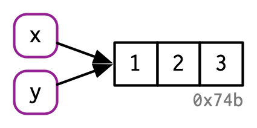
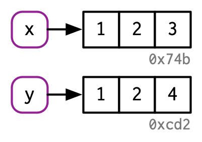
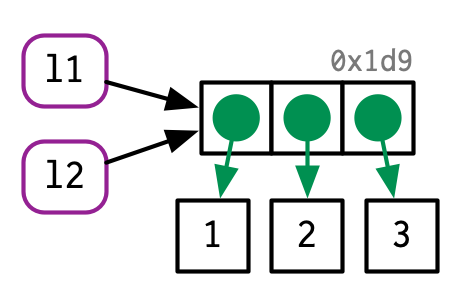
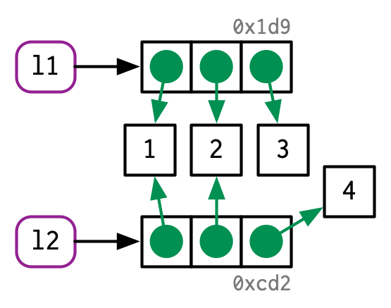

# Weitere Datenstrukturen

Als Nächstes betrachten wir weitere grundlegende Datenstrukturen in R; im Vordergrund hierbei stehen *Listen* und *Data Frames*. Die bisher besprochenen Datenstrukturen *(atomare) Vektoren*, *Matrizen* und *Arrays* sind homogene Datenstrukturen: alle Elemente haben den gleichen zugrun-deliegenden Datentyp, der nicht weiter unterteilt werden kann. Er ist entweder `logical`, `integer`, `double`, `complex`, `character` oder `raw`. 

Listen und Data Frames sind hingegen heterogen: in ihnen können Objekte unterschiedlicher Datentypen gespeichert werden. Das erste Listenelement kann z. B. ein Vektor der Länge 10 sein, während das zweite Listenelement eine 28×28-Matrix sein kann. 

## Listen

Wie wir gesehen haben, können in einem einzelnen (atomaren) Vektor nicht Objekte gespeichert werden, die unterschiedliche Datentypen besitzen; hierzu benutzt man Listen. Eine Liste ist ein linear angeordneter Datencontainer, dessen Elemente auf andere Objekte verweisen; eine Liste kann somit also konzeptionell als ein Vektor von Referenzen aufgefasst werden. Intern ist in R der Datentyp Liste als Vektor implementiert und es gibt strenggenommen in R die Unterscheidung zwischen atomaren und nicht-atomaren Vektoren. Da Listen auch Listen als Elemente enthalten können, die ihrerseits wiederum Listen als Elemente enthalten können, ... werden Listen auch manchmal *rekursive* Vektoren genannt. Wir werden aber bei unserer Konvention bleiben und im Folgenden immer atomare Vektoren meinen, wenn wir von Vektoren reden.

### Erzeugung von Listen und Indexierung

Als erstes einfaches Beispiel soll eine Liste in R erzeugt werden, die Prüfungsdaten eines Studenten enthält:

```{r}
x <- list(nachname = "Meier", matNr = 123456, noten = c (1.3, 2.7))
x
```

Es empfiehlt sich, `str()` zu benutzen, um eine kompakte und übersichtliche Ausgabe der Liste zu erhalten:
```{r}
str(x)
```

`x` ist also eine Liste mit drei Elementen; jedes Element hat dabei einen Namen.  Das dritte Listenelement zeigt auf einen numerischen Vektor der Länge 2. Weiterhin erhalten wir:

```{r}
length(x)
typeof(x)
class(x)
is.list(x)
attributes(x)
```

In vielen Programmiersprachen kann mithilfe der Punktnotation auf ein Listenelement zugegriffen werden. Dies ist in R nicht möglich! In R wird stattdessen das Dollarzeichen benutzt, um über den Namen auf ein Listenelement zuzugreifen:
```{r, echo=TRUE, eval=FALSE}
x.noten
#R> Error: object 'x.noten' not found
```

```{r}
x$noten
x$matNr
```

Auch mithilfe des Indexoperators können Listenelemente angesprochen werden, allerdings unterscheidet sich der „*einfache*“ Indexoperator grundlegend vom „*doppelten*“ Indexoperator:

+ `x[3]` und `x[[3]]`

+ `x["noten"]` und `x[["noten"]]`

```{r, echo=TRUE, eval=TRUE}
str(x["noten"])

str(x[3])

str(x[["noten"]])

str(x[[3]])

str(x$noten)
```

Identische Ergebnisse erhält man jeweils durch: 
 
+ `x$noten`, `x[["noten"]]` und `x[[3]]`.

+ `x["noten"]` und `x[3]`.

Überraschenderweise geben `x["noten"]` und `x[3]` eine Liste zurück. Der einfache Indexopera-tor angewandt auf eine Liste gibt immer eine Teilliste zurück! Will man also das Element einer Liste erhalten, so muss der doppelte Indexoperator benutzt werden. Aus Konsistenzgründen emp-fehlen daher manche Autoren sogar, auch bei Vektoren den doppelten Indexoperator zu benutzen, da es bei Vektoren keinen Unterschied zwischen beiden Schreibweisen gibt:

```{r, echo=TRUE, eval=TRUE}
v <- 1:4
v[[1]]
identical(v[1], v[[1]])
xv <- as.list(1, 2, 3, 4)
str(xv)
str(xv[1])
str(xv[[1]])
identical(xv[1], xv[[1]])
```

Indizierung kann wie bei Vektoren angewandt werden:
```{r}
x[1:2]
```

Hingegen:
```{r, echo=TRUE, eval=FALSE}
x[[1:2]]
#R> Error in x[[1:2]] : subscript out of bounds
```

Unser erstes Listenbeispiel hätte auch ohne Namen erzeugt werden können:
```{r}
x1 <- list("Meier", 123456, c(1.3, 2.7, 1.0))
x1

str(x1)
```

Aber es ist in der Regel besser und übersichtlicher, Namen zu verwenden.\newline
Beachten Sie auch den Unterschied zwischen den nächsten drei einzelnen Anweisungen:

```{r}
str(list(1:4))
str(list(1, 2, 3, 4))
str(as.list(1:4))
```

Listen können auch Listen als Element haben (und zwar grundsätzlich in „beliebiger“ Verschachtelungstiefe). Dies demonstrieren die nächsten drei Beispiele:
```{r}
yx <- list(pvl = c(T, T, F), x)
str(yx)
```

```{r}
yx2 <- list(yx, yx[2])
str(yx2)
```

```{r}
yx3 <-list(list(list(T)))
str(yx3)
```

Um aus einer verschachtelten Liste wieder einen „flachen“ Vektor zu erhalten, der alle atomaren Komponenten der Liste enthält, kann die Funktion `unlist()` benutzt werden:
```{r}
unlist(yx2)
```

### Listen ändern

Wir haben bereits gesehen, wie auf einzelne Listenelemente zugegriffen werden kann. Listen können in natürlicherweise durch Zuweisungen geändert werden. Elemente können gelöscht werden, indem sie den Wert `NULL` erhalten.\newline
Wir betrachten wieder unser einführendes Beispiel:
```{r}
str(x)
```

Ein Vorname soll eingefügt, die Matrikelnummer geändert und die Noten gelöscht werden:
```{r}
x$vorname <- "Udo"
x[[2]] <- 222333 # besser ?: x[["matNr"]] <- 222333
x$noten <- NULL
str(x)
```

Durch Kombination von Listen und Vektoren können Listen auch mit der bereits bekannten Funktion `c()` erstellt werden:
```{r}
z <- list(11, 12, 13)
z1 <- c(z, c(14, 15))
str(z1)

z2 <- c(c(14, 15), z)
str(z2)
```

Vergleichen Sie dies mit den folgenden beiden Anweisungen:
```{r}
z3 <- list(z, c(11, 12, 13))
str(z3)
```

```{r}
z <- list(11, 12, 13)
str(z)
z[4:5] <- c(14, 15)
str(z)
```


Frage:

+ Sind jetzt `z` und `z1` identisch?


### Vergleich: Liste versus Vektor

Wir wollen noch einmal kurz Listen und Vektoren gegenüberstellen und dabei insbesondere den Effekt von Copy-on-modify betrachten. Die im Folgenden benutzten Diagramme und die zugehörigen Beispiele sind aus @Wickham2019, Kapitel 2 entnommen. 

```{r}
x <- c(1, 2, 3)
y <- x
```

Wie wir bereits in Kapitel 3 erläutert haben, sind nun beide Namen (`x` und `y`) an dasselbe Objekt gebunden:

```{r, echo=FALSE, fig.cap="(ref:figlist-vektor-1)", out.width="80%"}

```

(ref:figlist-vektor-1) Abbildung aus @Wickham2019.

Wird `y` geändert,
```{r}
y[3] <- 4
```

dann „zeigen“ `x` und `y` auf verschiedene Objekte:

```{r, echo=FALSE, fig.cap="(ref:figlist-vektor-2)", out.width="80%"}

```

(ref:figlist-vektor-2) Abbildung aus @Wickham2019.

Wie sieht die vergleichbare Situation bei Listen aus?

```{r}
l1 <- list(1, 2, 3)
l2 <- l1
```

Da eine Liste ein linear angeordneter Datencontainer ist, dessen Elemente auf andere Objekte verweisen und der als ein Vektor von Referenzen aufgefasst werden kann, ergibt sich im Ver-gleich zum Vektor eine andere interne Implementierung. Dies wird im folgenden Diagramm deutlich:

```{r, echo=FALSE, fig.cap="(ref:figlist-vektor-3)", out.width="80%"}

```

(ref:figlist-vektor-3) Abbildung aus @Wickham2019.

Ändern wir `l2`,
```{r}
l2[[3]] <- 4
```
dann ergibt sich folgendes Bild:

```{r, echo=FALSE, fig.cap="(ref:figlist-vektor-4)", out.width="80%"}

```

(ref:figlist-vektor-4) Abbildung aus @Wickham2019.

### `lapply()` und `sapply()`

Die Funktion `lapply()` (für *list apply*) bezieht sich auf Listen und entspricht der Funktion `apply()`. Sie wird auf Listen angewandt (oder auf Vektoren die in Listen umgewandelt werden), während `apply()` auf Matrizen angewandt wird. Zur Illustration wollen wir folgendes Beispiel betrachten:
```{r}
l <- list(9:0, 1:100, 4)
str(l)
```

Mithilfe von `lapply()` können wir die `mean()`-Funktion auf alle Listenelemente anwenden:
```{r}
lapply(X = l, FUN = mean)
```

Das Ergebnis ist wiederum eine Liste.

Die benutzerfreundlichere Version `sapply()` (für *simplified list apply*) kann ebenfalls auf Listen angewandt werden; sie gibt in der Regel eine homogene Datenstruktur wie Vektor oder Matrix zurück. In unserem Beispiel ist dies ein Vektor:
```{r}
sapply(X = l, FUN = mean)
```

`sapply()` kann aber auch eine Matrix zurückgeben:
```{r}
sapply(X = l, FUN = range)
```

Vergleichen Sie hierzu:
```{r}
lapply(X = l, FUN = range)
```

**Kurzzusammenfassung**

> - `list()`
> -	`[]`, `[[ ]]`, `$`
> -	`is.list()`, `as.list()`
> -	`unlist()`
> -	`lapply()`, `sapply()`

## Factor

Mithilfe von Faktoren ist es in R möglich, nominalskalierte oder ordinalskalierte Daten  zu bearbeiten.

Fragen:

+	Was sind nominalskalierte Daten?

+	Was sind ordinalskalierte Daten?

+	Was sind kardinalskalierte Daten?

Als Beispiel wollen wir einen Datensatz `data` betrachten, der aus 30 nominalskalierten Werten besteht, die den belegten Studiengang Maschinenbau (MB), Elektrotechnik (ET), Wirtschaftsinge-nieur (WIng) und Wirtschaftsinformatik (WInfo) von 30 Studierenden angibt:

```{r}
studiengang <- c("MB", "ET", "WIng", "WInfo")
data <- sample(x = studiengang, size = 30, replace = TRUE)
data
str(data)
```

Der Datensatz `data` besitzt vier unterschiedliche Kategorien: "MB", "ET", "WIng", "WInfo", die wir im Folgenden, wie in R üblich, als *Level* bezeichnen wollen. Somit können wir den Datensatz auch als einen `integer`-Vektor der Länge 30 interpretieren, der nur die Werte 1, 2, 3 und 4 enthält. Genau dies erreichen wir mit einer Umwandlung in einen Faktor:
```{r}
f1 <- factor(data)
f1
str(f1)
levels(f1)
attributes(f1)
```

Mit der Funktion `levels()` können wir die entsprechenden Level erhalten, die bei der Umwand-lung automatisch erzeugt wurden. Wenn wir wollen, dass "MB" für 1, "ET" für 2, "WIng" für 3 und "WInfo" für 4 steht, dann müssen wir die Level explizit in der entsprechenden Reihenfolge angeben: 
```{r}
f2 <- factor(data, c("MB", "ET", "WIng", "WInfo"))
str(f2)
```

Wenn wir uns stattdessen auf nur drei Level beschränken, dann erhalten wir entsprechende `NA`-Werte:  
```{r}
f3 <- factor(data, c("MB", "ET", "WIng"))
str(f3)
```

Um aus einem Faktor wieder einen Vektor zu erzeugen, gibt es verschiedene Möglichkeiten, die allerdings zu unterschiedlichen Ergebnissen führen:
```{r}
str(as.vector(f1))
str(as.numeric(f1))
str(levels(f1)[f1])
```

Mithilfe der Funktion `table()` kann ein Faktor auch in Tabellenform angezeigt werden:
```{r}
table(f1)
```

Ein ähnliches Ergebnis erhält man auch mit der generischen Funktion `summary()`:
```{r}
summary(f1)
```

Mit der Funktion `barplot()`, mit der leicht Balkendiagramme erzeugt werden können, können die Daten aus f1 visualisiert werden. `barplot(table(f1))` liefert folgendes Balkendiagramm:
```{r barplot-f1, fig.cap="(ref:barplotf1)"}
barplot(table(f1), xlab = "Studiengänge", ylab = "Absolute Häufigkeit")
```

(ref:barplotf1) Balkendiagramm basierend auf der Variablen `f1`.

Die Daten in `f1` sind nominalskaliert, jedoch nicht ordinalskaliert. Daher ist die folgende Fehler-meldung nicht überraschend:

```{r, eval=FALSE}
min(f1)
#R> Error in Summary.factor(c(2L, 4L, 2L, 4L, 1L, 4L, 4L, 2L, 1L, 4L, 3L,  :
#R> ‘min’ not meaningful for factors
```

Allerdings ist R hier nicht konsequent, da `f1` sortiert werden kann:

```{r}
sort(f1)
```

Ein Faktor kann aber auch mit ordinalskalierten Daten umgehen. Angenommen wir haben in unseren Studiengängen eine feste Reihenfolge vorgegeben, wie\newline
"ET"  <  "WIng"  <  "MB"  <  "WInfo".\newline
Mit der option `ordered = TRUE` können wir dies mit einbringen:

```{r}
f4 <- factor(data, levels= c( "ET", "WIng","MB", "WInfo"), ordered = TRUE)
```

und erhalten dann:
```{r}
min(f4)
range(f4)
sort(f4)
```

Das entsprechende Balkendiagramm berücksichtigt dann auch die vorgegebene Reihenfolge:
```{r barplot-f4, fig.cap="(ref:barplotf4)"}
barplot(table(f4), xlab = "Studiengänge", ylab = "Absolute Häufigkeit")
```

(ref:barplotf4) Balkendiagramm basierend auf der Variablen `f4`.

Um kardinalskalierte Daten in Bereiche aufzuteilen, kann die Funktion `cut()` benutzt werden, die aus einem numerischen Vektor einen Faktor erzeugt. Wir wollen dies kurz an einem Beispiel illustrieren. Der Vektor `punkte` soll hierbei die Anzahl der erreichten Punkte in einer Klausur mit 200 Teilnehmern simulieren:

```{r}
punkte <- rnorm(200, mean = 100, sd = 10)
summary(punkte)
```

Im einfachsten Fall können wir den Wertebereich in 8 gleich große Bereiche unterteilen:
```{r}
c1 <- cut(punkte, breaks = 8)
str(c1)
table(c1)
```

```{r barplot-c1, fig.cap="(ref:barplotc1)"}
barplot(table(c1), ylab = "Absolute Häufigkeit")
```

(ref:barplotc1) Balkendiagramm basierend auf der Variablen `c1`.

Für die einzelnen Level wurde die mathematische Notation für halboffene Intervalle (a,b] benutzt. Es ist aber auch möglich, die einzelnen Bereiche explizit anzugeben:

```{r}
c2 <- cut(punkte, breaks = seq(from = 65, to = 135, by = 10))
str(c2)
table(c2)
```

```{r barplot-c2, fig.cap="(ref:barplotc2)"}
barplot(table(c2), ylab = "Absolute Häufigkeit")
```

(ref:barplotc2) Balkendiagramm basierend auf der Variablen `c2`.

**Kurzzusammenfassung**

> - `factor()`, `levels()`, `ordered = TRUE`
> -	`barplot()`, `table()`
> -	`cut()`


## Data Frame

Viele Datensätze liegen in Form von Tabellen vor, da Tabellen oft als grundlegende Datenstruktur eingesetzt werden. Dies ist zum Beispiel der Fall bei relationalen Datenbanken: aus konzeptioneller oder externer Sicht betrachtet, bestehen Datensätze in relationalen Datenbanken aus Tabellen . Auch in der Statistik werden Tabellen betrachtet: üblich ist es, dass dann die Spalten Variablen und die Zeilen Beobachtungen (Observationen) entsprechen.

Wie wir sehen werden, besitzt R mit Data Frame eine mächtige Datenstruktur, die aus konzeptio-neller Sicht einer Tabelle entspricht. Da eine Tabelle (und somit ein Data Frame) aus Zeilen und Spalten besteht, also zweidimensional ist, ist sie ähnlich zu einer Matrix. Aber es gibt einen be-deutenden Unterschied zwischen einer Matrix und einer Tabelle: in einer Tabelle können den einzelnen Spalten unterschiedliche Datentypen zugrunde liegen; eine Matrix hingegen ist homogen. Intern ist ein Data Frame im einfachsten Fall eine Liste mit der einschränkenden Bedingung, dass jedes Listenelement ein Vektor gleicher Länge ist. Insgesamt finden wir in R also folgende grundlegende Datenstrukturen vor:

(ref:Datenstrukturen) Vergleich von Datenstrukturen in R.

```{r, echo=FALSE, eval=TRUE}
df <- data.frame(Dimension = c("1", "2", "n"),
                 homogen = c("vector, factor", "matrix", "array"),
                 storage.mode = c("list", "data frame", ""))
knitr::kable(df, booktabs = T, caption = "(ref:Datenstrukturen)")%>%
 kableExtra::kable_styling(latex_options = "hold_position")
```

Wir unterscheiden hier zwischen Dimension  und Länge! Zum Beispiel betrachten wir einen (atomaren) Vektor als eine eindimensionale Datenstruktur, der allerdings eine beliebig große Länge haben kann.

### Data Frame erzeugen

Als nächstes Beispiel wollen wir folgenden Datensatz betrachten:

(ref:DfZeit) Beispieldatensatz Zeitmessung.

```{r, echo=FALSE, eval=TRUE}
df <- data.frame(n = c(40000000, 50000000, 60000000, 70000000, 80000000, 90000000),
                 Messung1 = c(3.656, 4.672, 5.719, 6.720, 7.641, 8.750),
                 Messung2 = c(3.781, 4.735, 5.672, 6.782, 7.673, 8.798),
                 Messung3 = c(3.719, 4.719, 5.672, 6.688, 7.704, 9.048),
                 Messung4 = c(3.766, 4.688, 5.625, 6.610, 7.750, 8.735))
knitr::kable(df, booktabs = T, col.names = c("n", "Messung 1", "Messung 2", "Messung 3", "Messung 4"), caption = "(ref:DfZeit)")%>%
 kableExtra::kable_styling(latex_options = "hold_position")
```

Dieser Datensatz enthält für sechs unterschiedliche $n$-Werte jeweils vier Zeitmessungen. Gemessen wurde dabei, wie lange eine bestimmte Implementierung des Quicksort-Algorithmus auf einem gegebenen Rechner braucht, um $n$ ganze Zahlen zu sortieren. Die zu sortierenden Daten wurden vor jeder einzelnen Zeitmessung „zufällig“ erzeugt. 

Die entsprechenden Werte wurden in einer CSV-Datei „zeiten1.csv“ hinterlegt.

Wir können den Datensatz dieser Datei leicht in R einlesen, vorausgesetzt die Datei „zeiten1.csv“ befindet sich im Arbeitsverzeichnis:

```{r}
df1 <- read.csv2("zeiten1.csv")
df1
```

Zum Einlesen wurde die Funktion `read.csv2()` benutzt, eine Variante der Funktion `read.table()`. Die Funktion `read.table()` ist die Standardfunktion in R zum Einlesen von Tabellendaten. Abgesehen von bereits für CSV-Dateien  geeignet gesetzten Defaultwerten, sind die beiden Varianten `read.csv()` und `read.csv2()` identisch zu `read.table()`. Die Funktion `read.csv2()` eignet sich besonders für Dateien, in denen das Komma als Dezimaltrennzeichen und das Semikolon als Datentrennzeichen benutzt wird; genau dies ist bei unserer Datendatei „zeiten1.csv“ der Fall.

`df1` ist nun ein Data Frame bestehend aus 5 Variablen (der Anzahl „n“ plus vier Messvariablen) und 6 Observationen: 
```{r}
str(df1)
```

Die Namen der Spaltenvariablen sind mit leichter Veränderung aus den Daten der Datei übernommen worden:
```{r}
names(df1)
```
Ein Data Frame kann natürlich auch explizit erzeugt werden. Hierzu benutzen wir die Funktion `data.frame()`:
```{r}
n <- (4:9) * 1e7L
mess1 <- c(3.656, 4.672, 5.719, 6.720, 7.641, 8.750)
mess2 <- c(3.781, 4.735, 5.672, 6.782, 7.673, 8.798)
mess3 <- c(3.719, 4.719, 5.672, 6.688, 7.704, 9.048)
mess4 <- c(3.766, 4.688, 5.625, 6.610, 7.750, 8.735)
df2 <- data.frame(n, mess1, mess2, mess3, mess4)
```

Interessant ist, dass die Namen der Argumente aus dem Funktionsaufruf 
`data.frame(n, mess1, mess2, mess3, mess4)` direkt übernommen werden, wenn kein Name explizit angegeben wird.\newline
Wie wir sehen, sind die beiden Data Frames `df1` und `df2` nahezu identisch:
```{r}
str(df2)
```

Sie unterscheiden sich lediglich in den Namen: 
```{r}
names(df2)
```

Allerdings muss bei der Funktion `data.frame()` eine Besonderheit beachtet werden: in der Standardeinstellung werden `character`-Vektoren stets in Faktoren umgewandelt! Wir wollen hierzu folgendes Beispiel betrachten:
```{r}
bezeichnung <- paste("M", 1:6, sep = "")
str(bezeichnung)
df_a <- data.frame(n, bezeichnung, mess1)
str(df_a)
```

In diesem Beispiel wird ein Data Frame erzeugt, bestehend aus den Variablen `n`, `bezeichnung` und `mess1`. Allerdings wurde der `character`-Vektor `bezeichnung` in einen Faktor umgewandelt! Dies kann durch das benannte Argument `stringsAsFactors` verhindert werden:

```{r}
df_b <- data.frame(n, bezeichnung, mess1, stringsAsFactors = FALSE)
str(df_b)
```

### Der Indexoperator

Da ein Data Frame eine Liste der Spaltenvariablen ist, können die einzelnen Daten wie bei einer Liste angesprochen werden. Am übersichtlichsten kann über die Namen zugegriffen werden:

```{r}
str(df1$n)
str(df1$Messung.1)
df1$n[2]
```

Möglich ist es aber auch, den Indexoperator zu benutzen. Wie bei Listen gibt es auch hier einen gravierenden Unterschied zwischen dem einfachen und dem doppelten Indexoperator. Der einfache Indexoperator angewandt auf ein Data Frame gibt ein Data Frame zurück! Will man einzelne Elemente als Vektor erhalten, so muss ähnlich wie bei Listen der doppelte Indexoperator benutzt werden:

```{r}
str(df1[1])
str(df1[[1]])
str(df1["n"])
str(df1[["n"]])
```

Auf einzelne Tabellenwerte kann wie gewohnt zugegriffen werden:
```{r}
str(df1[2, 1])
str(df1[1, 2])
```

Auf den ersten Blick überraschend ist, dass Zugriffe auf Zeilen und Spalten unterschiedliche Datentypen zurückgeben. Zeilen werden als einzelne Observationen aufgefasst, während Spalten sich auf den Datenvektor einer Variablen beziehen:
```{r}
str(df1[1,]) ## 1. Zeile

str(df1[,1]) ## 1. Spalte
```

In unserem Beispiel ist `df1[-1]` der Teil des Data Frames, der die Messwerte erhält:
```{r}
str(df1[-1])
```

In unserem Fall hätten wir auch `df1[2:5]` statt `df1[-1]` schreiben können:
```{r}
identical(df1[-1], df1[2:5])
```

### `apply()`

Mithilfe von `apply()` können wir die Mittelwerte der gemessenen Zeiten ermitteln. Allgemein kann `apply()` angewandt werden, wenn die beteiligten Spalten denselben Datentyp haben. Die Mittelwerte für die 6 Observationen erhalten wir durch:

```{r}
apply(X = df1[-1], MARGIN = 1, FUN = mean)
```

Für $n$ = 40 000 000 ist also 3.73050 der Mittelwert der 4 Messwerte.\newline
Die Mittelwerte für jede der vier Messvariablen erhalten wir hingegen durch:
```{r}
apply(X = df1[-1], MARGIN = 2, FUN = mean)
```

Da ein Date Frame eine Liste der Spaltenvariablen ist, kann für die letzte Abfrage auch `lapply()` oder besser noch `sapply()` benutzt werden:
```{r}
sapply(X = df1[-1], FUN = mean)
```

### Filtern, Einfügen und Löschen

Wie bei Matrizen und Listen kann man in Data Frames filtern:

```{r}
df2$mess1 > 6
df2$mess1 > df2$mess3
df2[df2$mess1 > df2$mess3, ]
```

Der letzte Funktionsaufruf kann sogar noch kürzer geschrieben werden:
```{r}
df2[mess1 > mess3,]
```

Ähnlich wie bei Matrizen hätte man alternativ auch die Funktion `subset()` benutzen können.

Als Nächstes wollen wir eine Kopie von `df2` erstellen und eine neue Variable `diff1` zum Data Frame hinzufügen. Die neue Spaltenvariable soll gleich der Differenz der ersten beiden Messwerte sein:
```{r}
df3 <- df2
df3$diff1 <- df2$mess2 -df2$mess1
str(df3)
```

Wie bei Matrizen können auch `cbind()` und `rbind()` benutzt werden, um neuen Daten an jeder beliebigen Stelle einzufügen:

```{r}
Nummer <- 1:6
df3 <- cbind(df3[1], Nummer, df3[-1])
str(df3)
```

Auffällig ist, dass der Name „Nummer“ der hinzugefügten Spalte automatisch im Data Frame übernommen wird! Durch `df3$diff1 <- NULL` wird die Spaltenvariable `diff1` wieder gelöscht:

```{r}
df3$diff1 <- NULL
str(df3)
```

**Kurzzusammenfassung**

> - `data.frame()`
> - `read.table()`, `read.csv()`, `read.csv2()` 


## Übungen {-}

### Teil 1 {-}

**Aufgabe 1** 


Betrachten Sie folgenden Quelltext:
```{r, eval=FALSE}
x <- rnorm(1e4)
h <- hist(x)
```

a)	Welchen Datentyp hat `h`?

b)	Ist `h` eine Liste? 

c)	Was gibt `is.list(h)` zurück? 

d)	Was gibt `is.vector(h)` zurück?

e)	Welche Elemente hat `h`?

f)	Welchen Datentyp hat `unlist(h)`? 


**Aufgabe 2**

Gegeben ist ein Objekt `x` in R. Ist dann `is.vector(as.vector(x))` stets wahr?

**Aufgabe 3**

Gegegeben ist:

```{r, eval=FALSE}
v <- 1:4
w <- LETTERS[1:8]
l1 <- list(v,T, w[-1])
```

Mit welcher Anweisung können Sie innerhalb der Liste `l1` den Buchstaben *C* (der durch `w` einfügt wurde) durch den Buchstaben *U* ersetzen?

**Aufgabe 4**

Gegeben ist eine Liste `l1` der Form:

```{r}
l1 <- list("1"=4, "3"=8, "5"=12, "7"=16)
```

Wie können Sie mithilfe von `sum()`

a)	die Summe der Listenelemente (also 4+8+12+16) bestimmen?

b)	die Summe der Namen der Listenelemente (also 1+3+5+7) bestimmen?

**Hinweis:* `unlist()`

**Aufgabe 5**

Gegeben ist eine Liste `l1` mit mehr als einem Element. Was gibt dann `length(l1[2])` zurück?

**Aufgabe 6**

Gegeben ist eine Liste `l1`:

```{r}
l1 <- list(10:1, "Data Science",  c("Data Science", "FH SWF"), c(T, T, F))
```

a)	Was gibt `length(l1)` zurück?

b)	Bestimmen Sie die Länge des zweiten und des dritten Listenelements.

c)	Wie können Sie mit einem Aufruf die Länge aller Listenelemente als Vektor erhalten?

**Aufgabe 7**

Ändern Sie die Liste `l1` in der vorherigen Aufgabe so, dass `str(l1)` Folgendes zurückgibt:

```{r, echo=FALSE}
l1 <- list(10:1, "Data Science",  c("Data Science", "FH SWF"), c(T,T,F))
str(l1)
names(l1) <- LETTERS[1:length(l1)]
```

```{r}
str(l1)
```


**Aufgabe 8**

Gegeben ist:

```{r}
set.seed(42)
data <- sample(LETTERS[1:5], 100, replace=TRUE)
f1 <- factor(data, levels= c( "A", "B","C"), ordered = TRUE)
f1
```

a) Ersetzen Sie in `f1` den Wert `B` durch `X`, so dass sich folgende Ausgabe ergibt:

```{r, echo=FALSE}
levels(f1)
str(levels(f1))
levels(f1)[2] <- "X"
```

```{r}
f1
```

b)	Ersetzen Sie in `f1` die Werte `A` und `C` durch `Y`.

```{r, echo=FALSE, eval=FALSE}
levels(f1)
levels(f1)[1] <- "Y"
levels(f1)[3] <- "Y"
f1
```


c) Löschen Sie in `f1` alle `NA`-Werte:

```{r, echo=FALSE}
f1 <- f1[!is.na(f1)]
```

```{r}
f1
```

**Aufgabe 9**

Machen Sie sich mit den Funktionen `rev()` und `unique()` vertraut, die im einfachsten Fall auf einen Vektor angewandt werden.

a) Ist `identical(rev(1:100),100:1)` stets wahr?

b)	Gegeben ist: `d <- sample(1:10, 50, replace = TRUE)`.
Ist `identical(sort(unique(d)), 1:10)` stets wahr?

Bestimmen Sie per Simulation die ungefähre Wahrscheinlichkeit, dass 
`identical(sort(unique(d)), 1:10)` falsch ist.

Wie ändert sich diese so ermittelte Wahrscheinlichkeit, wenn man statt den Wert 50, die Werte 10, 20, 30, ..., 100 zugrunde legt?

c) Gegeben ist `f1` wie am Beginn der vorherigen Aufgabe. Bestimmen Sie
`rev(f1)` und `unique(f1)`.

**Aufgabe 10**

Wir haben im Abschnitt „Data Frame erzeugen“ gesehen, dass die Namen der Argumente automatisch übernommen werden, wenn kein Name explizit angegeben wird. Beispiel:

```{r}
bezeichnung <- paste("M", 1:6, sep="")
nr <- 1:6
df <- data.frame(nr, bezeichnung)
```

Gilt das auch für Listen?

### Teil 2 {-}

Für die Aufgaben im Teil 2 betrachten wir ein Data Frame `student`. Erzeugt werden kann `student` durch:

```{r}
set.seed(1)
anzahl <-  100
Punkte <-  rnorm(anzahl, mean = 65, sd = 20)
Punkte <- as.integer(Punkte)
MatNr <- sample(1E6:1E7-1, anzahl)
names(MatNr) <- sample(c("ET","MB"), anzahl, replace=TRUE)
Bestanden <- F
student <- data.frame(MatNr, Punkte, Bestanden)
student$Stdgang <- names(MatNr)
rm(Punkte, MatNr,Bestanden,anzahl)
```

Die Ausgabe von `head(student)` lautet:

```{r}
head(student)
```

**Aufgabe 11** 

a)	Aus wie vielen Variablen und aus wie vielen Observationen besteht `student`?

b)	Die Funktionen `head(x)` und `tail(x)` liefern den ersten und letzten Teil von `x` zurück. Was wird ausgegeben durch: 

```{r, eval=FALSE}
head(student, n=10)
head(student, n=-95)
head(student, n=-93)
tail(student) 
```

c) Was wird ausgegeben durch: 

```{r}
student[1]
student[2] 
```

?

d) Geben Sie die erste Zeile von `student` aus.

e) Um die Klausur zu bestehen, reichen 50 Punkte. Ändern Sie `student` entsprechend!

```{r, echo=FALSE, eval=TRUE}
student$Bestanden <- student$Punkte >= 50
```

```{r}
head(student)
```


**Aufgabe 12**

In den Übungen zu Kapitel 4 haben wir bereits die Funktion `order()` kennengelernt.

a)	Was geben die Funktionen zurück:

    +	`order(student$Punkte)`
    +	`order(student$MatNr)`
    +	`order(student$Stdgang)`?
    
b)	Was wird zurückgegeben:

    +	`student[order(student$Punkte), ]`
    +	`student[order(student$MatNr), ]`
    +	`student[order(student$Stdgang), ]`? 
    
c) Geben Sie geordnet nach Punkten die Ergebnisse im Studiengang MB aus. Die Ausgabe der ersten zehn Zeilen in unserem Beispiel lautet dann:

```{r, echo=FALSE}
s <- student[order(student$Punkte),]
s <- s[s$Stdgang=="MB",]
```

```{r}
head(s, 10)
```

**Aufgabe 13**

Als Nächstes sollen Noten in `student` eingefügt werden. Zugrunde liegt das folgende Notenschema:

Note     | Punkte  |
---------|---------|
4        | 50--58  |
3        | 59--69  |
2        | 70--80  |
1        |  >= 81  |

a) Benutzen Sie die Funktion `cut()`, um aus `student$Punkte` einen Faktor zu erzeugen, der als Note in `student` eingefügt werden kann. Die Ausgabe der ersten zehn Zeilen in unserem Bespiel lautet dann:

```{r, echo=FALSE}
notenFaktor <- cut(student$Punkte,  breaks=c(0, 49, 58, 69, 80, Inf))
# str(notenFaktor)
levels(notenFaktor)<-5:1
# str(notenFaktor)

student$Note <- notenFaktor
# student
```

```{r}
head(student, n=10)
```

b)	Geben Sie nach Punkten sortiert alle Studierenden aus, die mindestens 48 und höchstens 52 Punkte erhalten haben:

```{r, echo=FALSE}
# student$Punkte >= 48 & student$Punkte <= 52

s <- student[student$Punkte >= 48 & student$Punkte <= 52, ]
s <- s[order(s$Punkte),]
```

```{r}
s
```

c)	Geben Sie nach Punkten sortiert alle Studierenden aus, die mindestens 79 und höchstens 82 Punkte erhalten haben:

```{r, echo=FALSE}
s <- student[student$Punkte >= 79 & student$Punkte <= 82, ]
s <- s[order(s$Punkte),]
```

```{r}
s
```

d)	Erstellen Sie für den Notenspiegel ein entsprechendes Balkendiagramm: 

```{r barplot-noten, echo=FALSE, fig.cap="(ref:balk-noten)", out.width="80%"}
# head(student)
# str(notenFaktor)
notenFaktor1 <- factor(notenFaktor,levels <- 1:5 )
# str(notenFaktor1)
student$Note <- notenFaktor1
# head(student)

barplot(table(student$Note), main = "Notenspiegel", xlab="Noten", ylab="Anzahl")
```

(ref:balk-noten) Balkendiagramm des Notenspiegels.

e)	Ist `summary(student)` hilfreich?

**Kurzzusammenfassung**

> - rev()
> -	unique()

