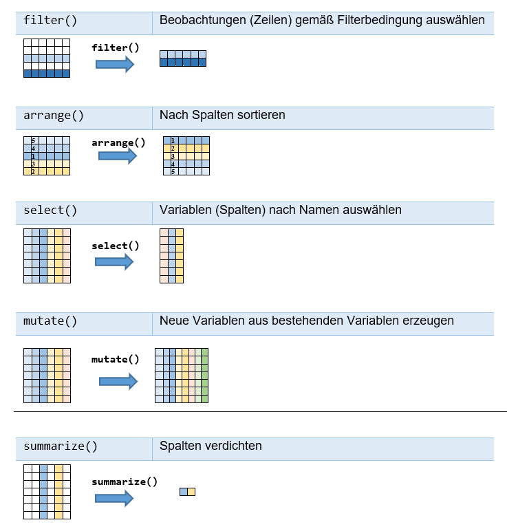
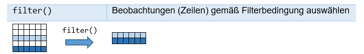
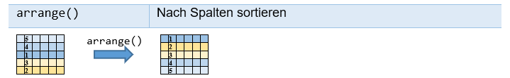
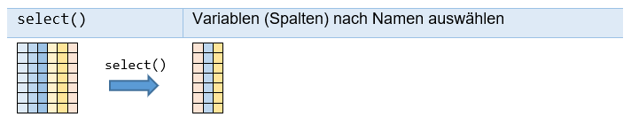
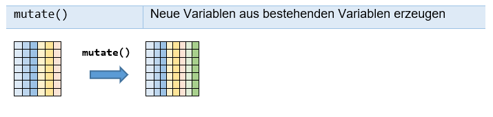
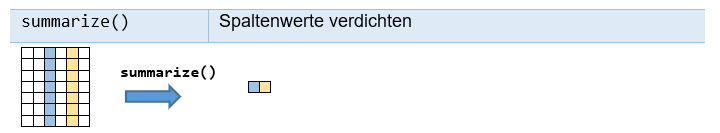

# Data Transformation

Parallel zu diesem Kapitel sollen Sie das Kapitel „5 Data transformation“  aus *„R for Data Sciences“* [R4DS] durcharbeiten, das sich mit dem dplyr -Paket auseinandersetzt, einer weiteren Kernkomponente der `tidyverse`-Welt.

Im Folgenden setzen wir voraus:
```{r, eval=FALSE}
library(tidyverse)
```

Dadurch werden die folgenden Pakete (packages) geladen:\newline
`ggplot2`, `purrr`, `tibble`, `dplyr`, `tidyr`, `stringr`, `readr`, `forcats`.

In diesem Kapitel wollen wir mit der großen Datensammlung `flights` arbeiten, die im `nycflights13`-Paket enthalten ist; daher setzen wir zusätzlich voraus:
```{r, eval=FALSE}
library(nycflights13)
```

## Der Datensatz `flights`

Der Datensatz `flights` beschreibt alle Flüge, die 2013 von einem der drei New Yorker Flughäfen (JFK, LGA or EWR) gestartet sind. 

```{r}
str(flights)
```

Der Datensatz `flights` ist ein „*Tibble*“. Ein Tibble ist ein leicht angepasster Data Frame, der besser mit `tidyverse` zusammenarbeitet. Im Vergleich zu einem Data Frame ist bei einem Tibble die Ausgabe eines großen Datensatzes viel besser gelöst. Auch ist der Zugriff auf Teilbereiche der Daten mit Tibbles konsistenter und strenger: mehr Warnungen werden ausgegeben, wenn angesprochene Spalten nicht existieren.  Im Gegensatz zu einem Data Frame wird bei der Erzeugung eines Tibbles nicht automatisch ein `character`-Vektor in einen Faktor umgewandelt.

Mithilfe von `as_tibble()` kann ein Data Frame leicht in einen Tibble umgewandelt werden. Ein Tibble kann auch direkt mit `tibble()` erzeugt werden. Auf Tibbles werden wir später zurückkommen.

Die Ausgabe des Tibbles `flights` ist in der Tat recht übersichtlich:
```{r}
flights
```

`flights` beschreibt also 336 776 Flüge mithilfe 19 Variablen.

(ref:varflights) Variablen des Datensatzes `flights`.

```{r, echo=FALSE, eval=TRUE}
df <- data.frame(col1 = c("year, month, day", "dep_time, arr_time", "sched_dep_time, sched_arr_time", "dep_delay, arr_dely", "carrier", "flight", "tailnum", "origin, dest", "air_time", "distance", "hour, minute", "time_hour"),
                 col2 = c("Date of departure.", "Actual departure and arrival times (format HHMM or HMM), local tz.", "Scheduled departure and arrival times (format HHMM or HMM), local tz.", "Departure and arrival delays, in minutes. Negative times represent early departures/arrivals.", "Two letter carrier abbreviation. See airlines to get name.", "Flight number.", "Plane tail number. See planes for additional metadata.", "Origin and destination. See airports for additional metadata.", "Amount of time spent in the air, in minutes.", "Distance between airports, in miles.", "Time of scheduled departure broken into hour and minutes.", "Scheduled date and hour of the flight as a POSIXct date. Along with 
origin, can be used to join flights data to weather data."))
knitr::kable(df, booktabs = T, col.names = c("", ""), caption = "(ref:varflights)")%>%
 kableExtra::kable_styling(latex_options = "hold_position")
```

## `dplyr`-Grundlagen

In `dplyr` gibt es fünf Schlüsselfunktionen , die jeweils ein Tibble (bzw. ein Data Frame) als erstes Element erwarten und als Resultat ein Tibble (bzw. ein Data Frame) zurückgeben.

(ref:dplyr-grundlagen) Schlüsselfunktionen in `dplyr`.

```{r, echo=FALSE, fig.cap="(ref:dplyr-grundlagen)", out.width="100%"}

```

Daneben gibt es noch Variationen dieser fünf Schlüsselfunktionen wie `rename()` oder `transmute()`. Viele dieser Funktionen berücksichtigen Gruppierungen, die mit der Funktion `group_by()` erstellt werden können. Anstatt auf dem gesamten Datensatz zu arbeiten, operieren sie dann auf den erstellten Gruppen. Dies wird insbesondere mit der Funktion `summarize()` häufig ausgenutzt. Wir werden hierauf weiter unten eingehen. 


### `filter()`: Zeilen auswählen

(ref:dplyr-filter) Funktion `filter()` des R-Pakets `dplyr`.

```{r, echo=FALSE, fig.cap="(ref:dplyr-filter)", out.width="100%"}

```

Mit `filter()` können gemäß einer Filterbedingung bestimmte Zeilen ausgewählt werden. Meh-rere Filterbedingungen werden dabei logisch mit „Und“ (also mit `&`) verknüpft.

`filter()` gibt:

+	komplette Datenzeilen zurück

+	nur Datenzeilen zurück, bei denen die Filterbedingung wahr ist; NA-Werte werden ausge-schlossen, es sei denn, sie tauchen explizit in der Filterbedingung auf.

**Beispiele**

```{r, eval=FALSE}
filter(flights, month == 1, day == 1)
filter(flights, month == 1 | month = 12)
filter(flights, month %in% c(11, 12))
```

**Hinweis:**

Der Operator `&&` bezieht sich bei Vektoren nur auf das erste Element; bei Vektoren sollte man statt `&&` den Operator `&` benutzen! Ähnliches gilt für die Operatoren `||` und `|` (siehe z. B. `?‘&‘`).


### `arrange()`: nach Spalten sortieren

(ref:dplyr-arrange) Funktion `arrange()` des R-Pakets `dplyr`.

```{r, echo=FALSE, fig.cap="(ref:dplyr-arrange)", out.width="100%"}

```

Mit `arrange()` kann nach Spalten sortiert werden. Mithilfe der Funktion `desc()` kann in absteigender Reihenfolge sortiert werden. 

**Beispiele**

```{r, eval=FALSE}
arrange(flights, year, month, day)
arrange(flights, desc(dep_delay))
```


### `select()`: Spalten auswählen


(ref:dplyr-select) Funktion `select()` des R-Pakets `dplyr`.

```{r, echo=FALSE, fig.cap="(ref:dplyr-select)", out.width="100%"}

```

Mit `select()` wird der Datensatz reduziert, indem nur bestimmte Spalten ausgewählt werden.

(ref:hilfsfunktionen) Nützliche Hilfsfunktionen.

```{r, echo=FALSE, eval=TRUE}
df <- data.frame(col1 = c("starts_with('abc')", "ends_with('xyz')", "contains('ijk')", "everything()"),
                 col2 = c("sucht nach Namen, die mit „abc“ beginnen", "sucht nach Namen, die mit „xyz“ beginnen", "sucht nach Namen, die „ijk“ enthalten", "Alle Variablen"))
knitr::kable(df, booktabs = T, col.names = c("", ""), caption = "(ref:hilfsfunktionen)")%>%
 kableExtra::kable_styling(latex_options = "hold_position")
```

Um Spaltennamen zu ändern, sollte die Funktion `rename()` benutzt werden.

**Beispiele**

```{r, eval=FALSE}
select(flights, year, month, day)
select(flights, year:day)
select(flights, -(year:day))
select(flights, year, month, day)
select(flights, year:day)
select(flights, -(year:day))
select(flights, starts_with("dep"))
select(flights, ends_with("time"))
select(flights, contains("dep"))
select(flights, time_hour, air_time, everything())
```


### `mutate()`: neue Spalten erzeugen

(ref:dplyr-mutate) Funktion `mutate()` des R-Pakets `dplyr`.

```{r, echo=FALSE, fig.cap="(ref:dplyr-mutate)", out.width="100%"}

```

Mit `mutate()` wird der Datensatz durch neue Spalten erweitert, die aus bestehenden Variablen erzeugt werden.  Bei Namensgleichheit werden bereits existierende Variablen überschrieben. `transmute()` lässt zusätzlich alle nicht genannten Spalten weg. 

**Beispiele**

```{r, eval=FALSE}
(flights_sml <- select(flights, year:day, ends_with("delay"), distance, air_time))
mutate(flights_sml, gain = dep_delay - arr_delay, speed = distance / air_time * 60)
mutate(flights_sml, gain = dep_delay - arr_delay, hours = air_time / 60, 
       gain_per_hour = gain / hours)   
transmute(flights, year, gain = dep_delay - arr_delay,hours = air_time / 60, gain_per_hour = gain / hours) 
```


### `summarize()`: Spalten verdichten

(ref:dplyr-summarize) Funktion `summarize()` des R-Pakets `dplyr`.

```{r, echo=FALSE, fig.cap="(ref:dplyr-summarize)", out.width="100%"}

```

Mit `summarize()` kann ein Datensatz auf eine einzelne Zeile reduziert werden, indem ausge-wählte Spalten verdichtet werden. `summarise()` und `summarize()` sind Synonyme.

**Beispiele**

```{r, eval=FALSE}
summarize(flights, delay = mean(dep_delay, na.rm = TRUE))
summarize(flights, delay = mean(dep_delay, na.rm = TRUE), 
 	sd = sd(dep_delay, na.rm = TRUE))
```

`summarize()` wird sehr häufig im Zusammenspiel mit `group_by()` verwendet. Wir werden weiter untern hierauf detaillierter eingehen.


### Der Pipe-Operator `%>%`

Der Pipe-Operator `%>%`  ist nicht Bestandteil von Base-R; er wird durch das `tidyverse`-Paket automatisch eingeführt und spielt in der `tidyverse`-Welt eine wichtige Rolle.

Allgemein gilt, dass 
```{r, eval=FALSE}
x %>% f(y)
```
äquivalent ist zu 
```{r, eval=FALSE}
f(x, y)
```

Folglich entspricht:
```{r, eval=FALSE}
x %>% f(y) %>% g(z) 
```
dem Ausdruck:
```{r, eval=FALSE}
g(f(x, y), z)
```

Als Beispiel wollen wir die Ausgabe der Funktion `sd()` auf drei verschiedene Arten nachrechnen. Dazu wollen wir die folgenden drei Funktionen nutzen:

```{r, eval=TRUE}
potenz <- function(x,n) return(x^n)
zentriere <- function(x) return(x - mean(x))
mittel <- function(x) return( sum(x)/ (length(x)-1)) # Precondition: length(x) > 1
```

Es gilt:
```{r}
d <- 1:10
sd(d)
```

In unserer ersten Variante rufen wir die Funktionen geschachtelt auf:

```{r}
sqrt(mittel(potenz(zentriere(d),2)))
```

In der zweiten Variante gehen wir schrittweise vor:

```{r}
res <- zentriere(d)
res <- potenz(res,2)
res <- mittel(res)
res <- sqrt(res)
res
```


In der dritten Variante nutzen wir schließlich den Pipe-Mechanismus  (ersetzt allerdings voraus, dass Base-R durch ein Paket wie `tidyverse` erweitert worden ist):

```{r}
d %>% 
  zentriere() %>%
  potenz(2)  %>%
  mittel() %>%
  sqrt()  
```

In komplexen Situationen kann der Pipe-Mechanismus die Lesbarkeit des Quelltextes deutlich erhöhen. Insbesondere in der `tidyverse`-Welt wird hiervon viel Gebrauch gemacht. Eine Ausnahme bildet `ggplot2`: es benutzt das gleiche Prinzip, nur wird dort leider `+` statt `%>%` benutzt!

### Gruppierungen mit `group_by()`

Die Funktion `group_by()` und ihr Gegenstück `ungroup()` ist für sich aus gesehen nicht besonders nützlich. Erst im Zusammenspiel mit Funktionen wie `summarize()`, die die erstellten Gruppierungen berücksichtigen, entfalten sie ihr Potential. Wir wollen dies an einem Beispiel verdeut-lichen. Aus Gründen der Übersichtlichkeit wollen wir hierbei nur einen Teil des Datensatzes `flights` benutzen:

```{r}
fluege <- select(flights, month, day, contains("delay"))
fluege <- filter(fluege, !is.na(arr_delay), !is.na(dep_delay))
fluege
```

Durch die beiden Filterbedingungen `!is.na(arr_delay)` und `!is.na(dep_delay)` schließen wir NA-Werte bei den Verspätungen aus.

Mithilfe des Pipe-Operators können wir stattdessen auch alternativ schreiben:
```{r, eval=FALSE}
fluege <- flights %>%
  select(month, day, contains("delay")) %>%
  filter(!is.na(arr_delay), !is.na(dep_delay))
```

Als Nächstes wollen wir die Funktion `group_by()` auf `fluege` anwenden:
```{r}
fluege_month <- group_by(fluege, month)
fluege_month
```

Wie man sieht, ist jetzt eine Gruppierung hinzugekommen, bestehend aus 12 Gruppen. Funktionen wie `summarize()` berücksichtigen diese Gruppierung:

```{r}
summarize(fluege, delay = mean(arr_delay))
summarize(fluege_month, delay = mean(arr_delay))
```

`summarize()` berücksichtigt die Gruppierung in `fluege_month`: die Mittelwerte werden nun pro Monat berechnet. Da hingegen `fluege` keine Gruppierung besitzt, wird im ersten Aufruf 
`summarize(fluege, delay = mean(arr_delay))` der Mittelwert über alle Daten berechnet.

Mit `ungroup()` kann die Gruppierung wieder rückgängig gemacht werden:
```{r}
summarize(ungroup(fluege_month), delay = mean(arr_delay))
```

Möglich sind auch Gruppierungen nach mehreren Variablen. Dies zeigt das nächste Beispiel:
```{r}
fluege_monthDay <- group_by(fluege, month, day)
summarize(fluege_monthDay, delay = mean(dep_delay))
```

Gruppierungen sind in Verbindung mit `summarize()` sehr nützlich, werden oft auch bei `mutate()` and `filter()` eingesetzt. Im nächsten Beispiel wird zu `fluege_month` eine zusätzliche Variable hinzugefügt, die in jeder Zeile die entsprechende monatliche durchschnittliche Ver-spätung bei der Ankunft angibt (vgl. `summarize(fluege_month, delay = me-an(arr_delay))`, siehe oben):

```{r}
fluege_month  %>%
   mutate(m_arr_delay = mean(arr_delay))
```

Entsprechend können wir die Gruppierung in Verbindung mit `filter()` nutzen:
```{r}
fluege_month  %>%
   filter(mean(arr_delay) > 10)
```

Zum Test können wir die Anzahl der Zeilen in der jeweiligen Gruppe bestimmen und die ausgegebenen Monate mit `summarize(fluege_month, delay = mean(arr_delay))` vergleichen:

```{r}
fluege_month  %>%
   filter(mean(arr_delay) > 10) %>% 
   summarize(count = n())
```

Die spezielle Funktion `n()` kann nur in den Funktionen `summarize()`, `mutate()` und `filter()` benutzt werden. Sie gibt die Anzahl der Observationen in der jeweiligen Gruppe zurück.


## Übungen {-}

Die folgenden Aufgaben beziehen sich auf den Datensatz `flights` aus dem Paket `nycflights13`.

**Aufgabe 1**

Welche der drei Funktionsaufrufe sind identisch? Was ist der Unterschied?

```{r, eval=FALSE}
filter(flights, month == 1, day == 1)
filter(flights, month == 1 & day == 1)
filter(flights, month == 1 && day == 1)
```


**Aufgabe 2**

a)	Gesucht sind alle Flüge, die mehr als 150 Minuten verspätet den Zielflughafen erreichten.

b)	Gesucht sind alle Flüge, die mehr als 150 Minuten verspätet den Zielflughafen erreichten, obwohl sie pünktlich gestartet waren.

c)	Alle Flüge in den Monaten September, Oktober, November und Dezember, die mit mehr als 150 Minuten Verspätung den Zielflughafen erreichten.


**Aufgabe 3**

Sind Verspätungen von mehr als 150 Minuten in den Monaten April bis September deutlich seltener als in den restlichen sechs Monaten des Jahres? Was sind die genauen Prozentzahlen?

**Aufgabe 4**

a) Gesucht sind alle Flüge, die mit mehr als 60 Minuten Verspätung gestartet sind, aber mehr als 60 Minuten im Flug aufgeholt haben.

b) Gesucht sind alle Flüge, die mit mehr als 60 Minuten Verspätung gestartet sind, aber mehr als 60 Minuten im Flug aufgeholt haben und nicht verspätet gelandet sind.

**Aufgabe 5**

a)	Bei wie vielen Flügen ist die Abflugzeit nicht aufgelistet?

b)	Bei wie vielen Flügen ist die Verspätung der Abflugzeit nicht aufgelistet?

c)	Bei wie vielen Flügen ist die Verspätung der Abflugzeit aufgelistet, aber nicht die Abflugzeit?


**Aufgabe 6**

Was ist der Unterschied zwischen:

```{r, eval=FALSE}
arrange(flights, year, month, day)
arrange(flights, day, month, year)
```

?

**Aufgabe 7**

a)	Wie lang ist die längste Flugroute? Von wo nach wo?

b)	Listen Sie sortiert nach Länge alle Flugrouten auf, die länger als 4000 km sind. Ausgegeben werden sollen pro Zeile: Start- und Zielflughafen und die Länge in Meilen und km (Umrechnung: 1.000 Meilen entsprechen 1.609,344 km). Benutzen Sie den Pipe-Operator.


**Aufgabe 8**

Was wird jeweils ausgegeben?

a)

```{r, eval=FALSE}
select(flights, year, month, year, day, year)
```

b)

```{r, eval=FALSE}
spalten <- c("year", "month", "day", "dep_delay", "arr_delay")
```

c)

```{r, eval=FALSE}
select(flights, contains("DEP"))
```

d)

```{r, eval=FALSE}
flights %>% 
  select(flight, contains("DEP")) %>% 
  head(4)
```


**Aufgabe 9**

Die Zeitformate `dep_time` und `sched_dep_time` in `flights` benutzen das Format HHMM oder HMM; 1607 entspricht also 16:07 Uhr. Erstellen Sie eine Tabelle mit allen Flüge mit den Spalten\newline
 	    `year`, `month`, `day`, `flight`, `dep_time`, `sched_dep_time` 
 	    
Dabei sollen `dep_time` und `sched_dep_time` eine Darstellung haben, die der Anzahl der Minuten nach Mitternacht entspricht. Schreiben Sie hierfür eine Funktion `zeitInMinuten()`. Die mögliche Zeitangabe 2400 für Mitternacht soll dabei auf 0 Minuten abgebildet werden (d.h. `zeitInMinuten(2400)` soll den Wert 0 zurückgeben).

**Aufgabe 10**

Erklären Sie folgende Ausgabe:

```{r, eval=FALSE}
flights %>% 
  select(flight, distance) %>%  
  unique() %>%
  group_by(flight)  %>% 
  mutate(dMin = min(distance), dMax = max(distance)) %>%
  mutate(r = min_rank(distance)) %>% 
  filter(dMax - dMin > 2500) %>% 
  arrange(dMax - dMin, distance) %>% 
  print(n = Inf)
```

